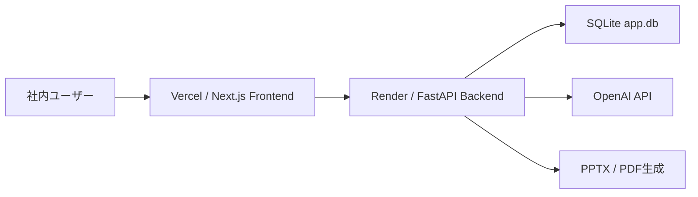

# AI営業秘書

Ready Crew の案件概要から、Web制作会社向けの営業提案書を自動生成するWebサービスです。

Frontend は Next.js、Backend は FastAPI、AI は OpenAI API を利用します。  
Vercel + Render にデプロイすると、`https://xxxxxxxx.vercel.app` のようなURLから誰でも利用できます。

## 主な機能

- 提案書生成
- 競合分析支援
- 見積AI
- ヒアリングシート生成
- ヒアリング結果の議事録整理
- Markdown出力
- 通常版PowerPoint出力
- 要約PowerPoint出力
- 見積書PDF出力
- 生成履歴のローカル保存

## ディレクトリ構成

```text
ready-crew-proposal-ai/
├─ backend/
│  ├─ app/
│  ├─ .env.example
│  └─ requirements.txt
├─ frontend/
│  ├─ app/
│  ├─ lib/
│  ├─ types/
│  ├─ .env.example
│  └─ package.json
├─ render.yaml
├─ .gitignore
└─ README.md
```

## ローカル起動

### Backend

```powershell
cd backend
python -m venv .venv
.\.venv\Scripts\activate
pip install -r requirements.txt
copy .env.example .env
uvicorn app.main:app --reload --port 8000
```

APIキーなしで動作確認する場合は、`backend/.env` の `USE_MOCK_AI=true` のまま使います。  
OpenAI API を使う場合は、`OPENAI_API_KEY` を入れて `USE_MOCK_AI=false` にします。

### Frontend

```powershell
cd frontend
npm install
copy .env.example .env.local
npm.cmd run dev
```

`frontend/.env.local` は以下です。

```env
NEXT_PUBLIC_API_URL=http://localhost:8000
```

ブラウザで開きます。

```text
http://localhost:3000
```

## 環境変数

### Frontend / Vercel

Vercel の Environment Variables に設定します。

```env
NEXT_PUBLIC_API_URL=https://your-render-backend.onrender.com
```

`NEXT_PUBLIC_API_URL` は、Render にデプロイした Backend のURLです。

### Backend / Render

Render の Environment Variables または Secrets に設定します。

```env
OPENAI_API_KEY=sk-...
OPENAI_MODEL=gpt-4.1-mini
USE_MOCK_AI=false
CORS_ORIGINS=https://your-vercel-app.vercel.app
CORS_ORIGIN_REGEX=^https://.*\.vercel\.app$
REQUEST_TIMEOUT_SECONDS=60
TMPDIR=/tmp
TEMP=/tmp
TMP=/tmp
```

`OPENAI_API_KEY` はコードやGitHubに保存しません。Render の Secret として登録します。

## 社内試験導入向けの安全設定

Version 4.0 では、社内で試験利用しやすいように簡易ログイン、接続状態表示、利用ログ、設定画面を追加しています。

### 目的

- 営業担当者が提案書生成AIを安全に試せる状態にする
- APIキーや管理者パスワードをFrontendへ露出させない
- 利用状況を本文なしで確認できるようにする
- 提出前に人が確認する運用を前提にする

### Backend / Render に追加する環境変数

```env
APP_ACCESS_PASSWORD=社内で共有するログインパスワード
APP_AUTH_SECRET=長いランダム文字列
APP_AUTH_TOKEN_TTL_SECONDS=43200
```

`APP_ACCESS_PASSWORD` は必須です。未設定の場合、ログインできず、提案書生成・PowerPoint・PDF出力APIは利用できません。  
`APP_AUTH_SECRET` はトークン署名用です。未設定の場合は `APP_ACCESS_PASSWORD` を使いますが、Renderでは別の長い値を設定することを推奨します。

### Frontend / Vercel の環境変数

```env
NEXT_PUBLIC_API_URL=https://your-render-backend.onrender.com
```

管理者パスワードや OpenAI API キーは Vercel のFrontend環境変数に設定しません。

### セキュリティ注意点

- 顧客の機密情報、個人情報、パスワードは入力しない
- 提案書・見積書はAI生成のため、提出前に必ず人が確認する
- 外部送信、削除、公開作業はAIに任せない
- 社外共有前に上長または担当者が確認する
- `.env` / `.env.local` はGit管理対象外にする

### 利用ログ

ブラウザの `localStorage` に以下のみ保存します。

- 生成日時
- 機能名
- 入力文字数
- 出力種別
- 成功 / 失敗
- エラー種別

以下は保存しません。

- 顧客名
- 個人名
- APIキー
- 入力本文全文
- 生成本文全文

### 試験導入時の確認項目

- ログイン前はアプリ本体が表示されない
- ログイン後に提案書生成ができる
- 通常版PPTX、要約PPTX、見積書PDFを出力できる
- 画面上の「接続状態」でBackend、AI API、PPTX、PDFの状態が確認できる
- 設定画面にBackend URL、ログイン状態、モックモード状態、最終接続確認日時が表示される
- 利用ログに本文が保存されていない

### トラブルシューティング

- ログインできない  
  Render の `APP_ACCESS_PASSWORD` が設定されているか確認してください。

- Backend接続が異常  
  RenderのサービスURL、Vercelの `NEXT_PUBLIC_API_URL`、CORS設定を確認してください。

- AI API が要確認  
  `USE_MOCK_AI`、`OPENAI_API_KEY`、OpenAIの利用上限を確認してください。

- PowerPoint / PDF が出力できない  
  Backendログを確認し、入力文字量を減らして再実行してください。

- Vercel公開環境で通信エラーになる  
  Renderの `CORS_ORIGINS` にVercel URLを追加するか、`CORS_ORIGIN_REGEX=^https://.*\.vercel\.app$` を設定してください。

## 現在の完成形

AI営業秘書 / AI Digital Coworker は、社内試験導入向けに以下を備えています。

- 簡易ログイン認証
- AI案件受付、情報抽出、営業アシスタント
- AI商談コーチ
- 社内業務AIタブ
- AI Digital Coworker
- Markdown、通常版PPTX、要約PPTX、見積書PDF
- 接続状態、設定画面、利用ログ
- Vercel Frontend / Render Backend 構成

## 入力を減らす使い方

### 1. ワンクリックサンプル生成

営業提案AIの画面で以下のサンプルを選ぶと、案件情報・見積条件・成功事例が自動で入ります。

- Webリニューアル案件
- 採用サイト案件
- LP制作案件
- SEO改善案件

### 2. 最小入力モード

以下の3項目だけで生成準備へ進めます。

- 会社名
- やりたいこと
- 困りごと

未入力項目は次のように仮補完します。

- 予算：未定
- 納期：要確認
- CMS：要確認
- 競合：未確認
- 決裁者：要確認
- ターゲット：要確認

### 3. AIに全部おまかせ

「AIに全部おまかせ」ボタンを押すと、貼り付け情報・会社URL・最小入力・かんたん入力の内容から、入力整理、不足情報の仮補完、提案方針作成、生成前確認画面表示まで進めます。

## 管理者が設定する環境変数

Render:

```env
APP_ACCESS_PASSWORD=社内共有パスワード
APP_AUTH_SECRET=長いランダム文字列
OPENAI_API_KEY=sk-...
USE_MOCK_AI=false
CORS_ORIGINS=https://your-vercel-app.vercel.app
CORS_ORIGIN_REGEX=^https://.*\.vercel\.app$
```

Vercel:

```env
NEXT_PUBLIC_API_URL=https://your-render-backend.onrender.com
```

## Vercel / Render 再デプロイ手順

1. 変更をGitHubへpushします。
2. Vercelは `frontend` をRoot Directoryとして再デプロイします。
3. Renderは `backend` の変更を検知して再デプロイします。
4. デプロイ後、Frontendの設定画面でBackend URLと接続状態を確認します。
5. ログイン後、提案書生成、PPTX、要約PPTX、見積書PDFを確認します。

## API制限時の対応

OpenAI API制限が出た場合は、以下を確認してください。

- 時間を置いて再実行
- OpenAIの利用上限・請求設定を確認
- Renderの `OPENAI_API_KEY` を確認
- デモ確認だけなら `USE_MOCK_AI=true` にしてモックモードで試す

## 今後の実装予定

- ユーザー管理の本格化
- PostgreSQL保存
- Gmail / Google Drive / Slack 連携
- 監査ログ
- 詳細な権限管理

## DB保存・ユーザー管理

社内試験導入から複数社員利用へ進めるため、BackendにSQLite保存を追加しています。

### DB保存の概要

DBファイル名は `app.db` です。Renderでは `DATABASE_URL=sqlite:///app.db` を設定します。  
現時点ではSQLiteですが、接続処理・リポジトリ層を分けているため、将来PostgreSQLへ移行しやすい構成にしています。

保存するもの:

- ユーザー
- 顧客
- 案件
- 提案書生成履歴
- 商談メモ
- 利用ログ

保存しないもの:

- OpenAI APIキー
- パスワードそのもの
- 入力本文全文
- 生成本文全文
- 顧客の機密情報

### 追加DBテーブル

- `users`
- `customers`
- `projects`
- `proposal_histories`
- `meeting_memos`
- `usage_logs`

### 初期管理者の作成方法

RenderまたはローカルのBackend環境変数に以下を設定します。

```env
INITIAL_ADMIN_EMAIL=admin@example.com
INITIAL_ADMIN_PASSWORD=安全なパスワード
APP_AUTH_SECRET=長いランダム文字列
DATABASE_URL=sqlite:///app.db
```

Backend起動時に、同じメールアドレスのユーザーが存在しなければ `admin` ロールで作成されます。

### ユーザーロール

- `admin`  
  全機能利用、ユーザー管理、ログ確認ができます。

- `member`  
  提案書生成、通常版PPTX、要約PPTX、見積書PDF、業務AIを利用できます。

- `viewer`  
  Dashboardと履歴閲覧のみです。提案書生成、PPTX/PDF生成はできません。

### Render環境変数

```env
INITIAL_ADMIN_EMAIL=admin@example.com
INITIAL_ADMIN_PASSWORD=安全な初期パスワード
APP_AUTH_SECRET=長いランダム文字列
APP_AUTH_TOKEN_TTL_SECONDS=43200
DATABASE_URL=sqlite:///app.db
OPENAI_API_KEY=sk-...
USE_MOCK_AI=false
CORS_ORIGINS=https://your-vercel-app.vercel.app
CORS_ORIGIN_REGEX=^https://.*\.vercel\.app$
```

### SQLite利用時の注意

SQLiteは社内試験導入には手軽ですが、Renderの無料/一時ファイル環境では永続性に制限があります。  
本格運用ではPostgreSQLへ移行してください。

### PostgreSQL移行予定

将来的には以下を行います。

- `DATABASE_URL` をPostgreSQL接続文字列へ変更
- `app/db.py` の接続処理をPostgreSQL対応に変更
- リポジトリ層のSQLをPostgreSQL互換へ調整
- 監査ログとバックアップ運用を追加

### 社内試験導入時の確認手順

1. Backendを起動し、`/health` の `db` が `connected` になることを確認
2. 初期管理者メールアドレスとパスワードでログイン
3. adminでユーザーを追加
4. memberで提案書生成、PPTX、要約PPTX、見積書PDFを確認
5. viewerで生成ボタンが使えないことを確認
6. 設定画面でDBログ件数とユーザー権限を確認
7. CRM画面で顧客・案件が表示されることを確認

## GitHubへアップロードする方法

1. GitHubで新しいリポジトリを作成します。
2. この `ready-crew-proposal-ai` フォルダをリポジトリとして使います。
3. 以下を実行します。

```powershell
git init
git add .
git commit -m "Initial deploy ready version"
git branch -M main
git remote add origin https://github.com/YOUR_NAME/YOUR_REPOSITORY.git
git push -u origin main
```

`.env` と `.env.local` は `.gitignore` に入っているため、GitHubへアップロードされません。

## Render登録・Backendデプロイ方法

1. Render に登録します。
2. GitHubアカウントを連携します。
3. Render の Dashboard で `New +` を押します。
4. `Blueprint` を選択します。
5. GitHubリポジトリを選択します。
6. `render.yaml` が読み込まれます。
7. `OPENAI_API_KEY` を Secret として入力します。
8. 作成すると Backend がデプロイされます。

Render の起動設定は `render.yaml` に入っています。

```yaml
buildCommand: pip install --upgrade pip && pip install -r requirements.txt
startCommand: uvicorn app.main:app --host 0.0.0.0 --port $PORT
healthCheckPath: /health
```

デプロイ後、以下にアクセスして確認します。

```text
https://your-render-backend.onrender.com/health
```

`{"status":"ok"}` が表示されればOKです。

## Vercel登録・Frontendデプロイ方法

1. Vercel に登録します。
2. GitHubアカウントを連携します。
3. `Add New Project` を押します。
4. GitHubリポジトリを選択します。
5. Root Directory を Frontend のディレクトリに指定します。
   - この `ready-crew-proposal-ai/` フォルダだけをGitHubへpushしている場合: `frontend`
   - この作業フォルダ全体をGitHubへpushしている場合: `ready-crew-proposal-ai/frontend`
6. Framework Preset は `Next.js` を選択します。
7. Environment Variables に以下を追加します。

```env
NEXT_PUBLIC_API_URL=https://your-render-backend.onrender.com
```

8. `Deploy` を押します。

デプロイ後、以下のようなURLが発行されます。

```text
https://your-vercel-app.vercel.app
```

### `vercel.json required to deploy projects with multiple services` が出る場合

このリポジトリには `frontend` と `backend` がありますが、Backend は Render にデプロイします。  
Vercelでは複数サービス構成を使わず、Frontend の Next.js だけをデプロイします。

対応方針は以下です。

- リポジトリルートの `vercel.json` は置きません
- `frontend/vercel.json` も置きません
- Vercel の Root Directory を必ず `frontend` にします
- `backend/` と `render.yaml` は `.vercelignore` でVercel対象外にします

Vercel の設定画面で Root Directory が空、またはリポジトリルートになっていると、Backend まで検出されることがあります。  
必ず Root Directory を `frontend` に変更してから Deploy してください。

## CORS設定

Vercel のURLが決まったら、Render の Backend 環境変数を更新します。

```env
CORS_ORIGINS=https://your-vercel-app.vercel.app
```

プレビューURLも許可したい場合は、以下を設定します。

```env
CORS_ORIGIN_REGEX=^https://.*\.vercel\.app$
```

更新後、Render で Backend を再デプロイします。

## デプロイ順序

おすすめの順序です。

1. GitHubへpush
2. RenderでBackendをデプロイ
3. RenderのURLをコピー
4. VercelでFrontendをデプロイ
5. Vercelに `NEXT_PUBLIC_API_URL` を設定
6. VercelのURLをコピー
7. Renderに `CORS_ORIGINS` を設定
8. RenderとVercelを再デプロイ

## 更新方法

コードを修正したら、GitHubへpushします。

```powershell
git add .
git commit -m "Update proposal AI"
git push
```

Vercel と Render は GitHub 連携により自動で再デプロイされます。  
環境変数を変更した場合は、各サービスの管理画面から手動で再デプロイしてください。

## 独自ドメイン設定方法

### Frontend

1. Vercel の対象プロジェクトを開きます。
2. `Settings` → `Domains` を開きます。
3. 使いたいドメインを追加します。
4. 表示されたDNSレコードを、ドメイン管理サービス側に設定します。
5. 反映後、独自ドメインで画面を開けるようになります。

独自ドメインを使う場合は、Render の `CORS_ORIGINS` にも追加します。

```env
CORS_ORIGINS=https://your-domain.com,https://your-vercel-app.vercel.app
```

### Backend

Backendにも独自ドメインを使う場合は、Render の `Settings` → `Custom Domains` から追加します。  
その場合は、Vercel の `NEXT_PUBLIC_API_URL` を Backend の独自ドメインに変更します。

## PowerPoint・PDF生成について

通常版PowerPoint、要約PowerPoint、見積書PDFは Backend で生成します。  
Frontend は生成APIを呼び出し、ファイルをダウンロードするだけです。

生成データはメモリ上で作成して返却します。クラウド環境で一時領域が必要になった場合も、Render では `/tmp` を使う設定にしています。

## 本番動作確認

Vercel の公開URLで以下を確認します。

1. サンプル入力を押す
2. 提案書初稿を生成する
3. Markdown結果が表示される
4. 競合分析が表示される
5. 見積AIが表示される
6. ヒアリングシートが表示される
7. 通常版PowerPointをダウンロードする
8. 要約PowerPointをダウンロードする
9. 見積書PDFをダウンロードする

## よくあるトラブル

### FrontendからBackendに接続できない

Vercel の `NEXT_PUBLIC_API_URL` が Render のURLになっているか確認します。  
Render の `CORS_ORIGINS` に Vercel のURLが入っているか確認します。

### PowerPointやPDFが失敗する

Render のログを確認します。  
`OPENAI_API_KEY`、`USE_MOCK_AI`、`REQUEST_TIMEOUT_SECONDS` を確認します。

### ローカル画面のCSSが反映されない

Frontend を止めて、`.next` を消してから再起動します。

```powershell
Remove-Item -Recurse -Force .next
npm.cmd run dev
```

## セキュリティ注意

- `OPENAI_API_KEY` はGitHubへpushしません。
- `.env` と `.env.local` はGit管理対象外です。
- 誰でも使える公開URLにする場合、OpenAI API の利用料金が発生します。
- 実運用では、ログイン、利用回数制限、IP制限、レート制限の追加を推奨します。

## Version 1.0 RC1 運用ガイド

### 構成図



### 画面一覧

- Dashboard: 今日・今月の生成数、削減時間、平均品質を確認
- 営業提案AI: 案件情報貼り付け、提案書生成、PPTX/PDF出力
- 商談コーチAI: 商談前質問、商談評価、日報、上司報告
- 社内業務AI: 議事録、メール、タスク、FAQ、資料要約、日報/週報
- CRM: 顧客、案件、提案履歴、商談メモの一覧
- 設定: 接続状態、ログイン状態、DB状態、利用ログ
- 管理者: ユーザー管理、Audit Log

### API一覧

| API | 用途 | 権限 |
| --- | --- | --- |
| `GET /health` | Backend / AI / DB状態確認 | 公開 |
| `POST /api/auth/login` | ログイン | 公開 |
| `GET /api/auth/status` | ログイン状態確認 | login |
| `GET /api/users` | ユーザー一覧 | admin |
| `POST /api/users` | ユーザー追加 | admin |
| `PATCH /api/users/{user_id}` | ユーザー有効/無効 | admin |
| `POST /api/analyze` | 提案書生成 | admin/member |
| `POST /api/company-research` | 会社URL調査 | admin/member |
| `POST /api/download-pptx` | 通常/要約PPTX生成 | admin/member |
| `POST /api/download-estimate-pdf` | 見積書PDF生成 | admin/member |
| `GET /api/projects/crm` | CRM一覧 | admin/member/viewer |
| `GET /api/projects/crm/{project_id}` | 案件詳細 | admin/member/viewer |
| `GET /api/logs` | 利用ログ | admin/member/viewer |
| `POST /api/logs` | 利用ログ保存 | admin/member/viewer |
| `GET /api/logs/audit` | 監査ログ | admin |

### DB構成

| テーブル | 内容 |
| --- | --- |
| `users` | ユーザー、ロール、有効状態 |
| `customers` | 顧客の最小メタ情報 |
| `projects` | 案件名、ステータス、受注確率、要約 |
| `proposal_histories` | 提案書生成履歴 |
| `meeting_memos` | 商談メモ要約 |
| `usage_logs` | 機能別の利用ログ |
| `audit_logs` | ログイン、生成、保存、設定変更の監査ログ |

本文全文、生成本文全文、APIキー、パスワードは保存しません。

### 環境変数

Frontend / Vercel:

```env
NEXT_PUBLIC_API_URL=https://your-render-backend.onrender.com
```

Backend / Render:

```env
OPENAI_API_KEY=sk-...
OPENAI_MODEL=gpt-4.1-mini
USE_MOCK_AI=false
CORS_ORIGINS=https://your-vercel-app.vercel.app
CORS_ORIGIN_REGEX=^https://.*\.vercel\.app$
INITIAL_ADMIN_EMAIL=admin@example.com
INITIAL_ADMIN_PASSWORD=change-me
APP_AUTH_SECRET=long-random-secret
APP_AUTH_TOKEN_TTL_SECONDS=43200
DATABASE_URL=sqlite:///app.db
LOG_LEVEL=INFO
```

### デプロイ

1. GitHubへpushします。
2. RenderでBackendを再デプロイします。
3. VercelでRoot Directoryを `frontend` にして再デプロイします。
4. Vercelの `NEXT_PUBLIC_API_URL` がRender URLになっていることを確認します。
5. Renderの `CORS_ORIGINS` にVercel URLを設定します。

### トラブル対応

- ログインできない: `INITIAL_ADMIN_EMAIL`、`INITIAL_ADMIN_PASSWORD`、`APP_AUTH_SECRET` を確認
- Viewerで生成できない: 正常です。memberまたはadminでログインしてください
- Backend未接続: `NEXT_PUBLIC_API_URL`、Render起動状態、CORSを確認
- AI API制限: 時間を置くか、社内デモでは `USE_MOCK_AI=true` で確認
- PPTX/PDF失敗: Backendログと入力文字数を確認
- DBエラー: Renderのディスク、`DATABASE_URL`、`app.db` の書き込み権限を確認

### 運用方法

- 管理者が初期ユーザーでログインし、member/viewerを追加します。
- 通常利用者はmemberで利用します。
- 閲覧のみの人はviewerにします。
- 管理者は定期的にAudit Logと利用ログを確認します。
- 提案書・見積書は社外提出前に必ず人が確認します。

### バックアップ

SQLite利用時は、Renderの永続ディスク上にある `app.db` を定期的にバックアップしてください。  
将来の複数名運用ではPostgreSQLへ移行することを推奨します。

### 将来構想

- PostgreSQL移行
- 監査ログの長期保存
- 会社単位の権限管理
- Gmail / Google Drive / Slack / Teams連携
- 提案書テンプレートのRAG参照
- 利用回数制限、IP制限、レート制限
