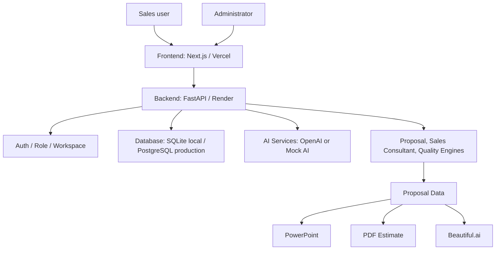

# Ready Crew Proposal AI

Ready Crew Proposal AI は、案件メール、議事録、ヒアリングメモから提案書の初稿を作成し、Customer Ready確認、Quality Report、PowerPoint / PDF / Beautiful.ai出力までを支援するWebサービスです。

Version 2.2は、開発プロジェクトから本番運用可能なWebサービスへ移行するためのRelease Candidateです。新しいAI機能を増やすのではなく、既存の提案生成、品質判定、出力、認証、権限、運用ドキュメントを整理しています。

## Current Release

- Release: Version 2.2 Customer-Ready Release Candidate
- Release date: 2026-07-30
- Backend: FastAPI on Render
- Frontend: Next.js on Vercel
- Database: SQLite for local, PostgreSQL recommended for production
- AI: OpenAI API, deterministic fallback/mock mode
- Output: PPTX, PDF estimate, Beautiful.ai

Latest release documents:

- [Version 2.2 Release Notes](docs/releases/VERSION_2.2_RELEASE.md)
- [Production Deployment Guide](docs/deployment/PRODUCTION_DEPLOYMENT.md)
- [Sales User Guide](docs/manual/SALES_USER_GUIDE.md)
- [Administrator Guide](docs/manual/ADMIN_GUIDE.md)
- [System Architecture](docs/architecture/SYSTEM_ARCHITECTURE.md)
- [Known Issues](KNOWN_ISSUES.md)
- [OSS License Inventory](docs/deployment/OSS_LICENSES.md)

## What Users Can Do

1. Paste project information such as customer email, meeting notes, or hearing memo.
2. Generate a proposal draft with AI.
3. Review the proposal summary, risks, KPIs, estimate, and slide structure.
4. Complete the customer-ready checks before external submission.
5. Download PowerPoint or PDF, or create a Beautiful.ai presentation.
6. Review generation history, quality reports, and improvement records.

## Main Capabilities

- Proposal generation from unstructured sales notes
- AI Sales Consultant analysis
- Customer Ready Gate
- Proposal Validation and Quality Report
- PowerPoint and summary PowerPoint generation
- PDF estimate generation
- Beautiful.ai Prompt API integration
- Proposal history and CSV export
- Business improvement report and dashboard
- Organization / Workspace separation
- Role-based access control
- Admin diagnostics, audit logs, and maintenance controls

## Architecture


```mermaid
flowchart TD
    User["Sales user"] --> Frontend["Frontend: Next.js / Vercel"]
    Admin["Administrator"] --> Frontend
    Frontend --> Backend["Backend: FastAPI / Render"]
    Backend --> Auth["Auth / Role / Workspace"]
    Backend --> DB["Database: SQLite local / PostgreSQL production"]
    Backend --> AI["AI Services: OpenAI or Mock AI"]
    Backend --> Engines["Proposal, Sales Consultant, Quality Engines"]
    Engines --> Proposal["Proposal Data"]
    Proposal --> PPTX["PowerPoint"]
    Proposal --> PDF["PDF Estimate"]
    Proposal --> Beautiful["Beautiful.ai"]
```

Detailed architecture: [docs/architecture/SYSTEM_ARCHITECTURE.md](docs/architecture/SYSTEM_ARCHITECTURE.md)

## Local Setup

### Backend

```powershell
cd backend
python -m venv .venv
.\.venv\Scripts\activate
pip install -r requirements.txt
copy .env.example .env
uvicorn app.main:app --reload --port 8000
```

Health check:

```powershell
Invoke-RestMethod http://localhost:8000/health
```

### Frontend

```powershell
cd frontend
npm install
copy .env.example .env.local
npm.cmd run dev
```

Open:

```text
http://localhost:3000
```

## Environment Variables

Backend examples are in [backend/.env.example](backend/.env.example). Frontend examples are in [frontend/.env.example](frontend/.env.example).

Important production variables:

| Area | Variables |
|---|---|
| Auth | `APP_AUTH_SECRET`, `INITIAL_ADMIN_EMAIL`, `INITIAL_ADMIN_PASSWORD` |
| Database | `DATABASE_URL` |
| CORS | `CORS_ORIGINS`, `CORS_ORIGIN_REGEX` |
| OpenAI | `OPENAI_API_KEY`, `OPENAI_MODEL`, `USE_MOCK_AI` |
| Beautiful.ai | `BEAUTIFUL_AI_ENABLED`, `BEAUTIFUL_AI_API_KEY`, `BEAUTIFUL_AI_API_MODE`, `BEAUTIFUL_AI_BASE_URL` |
| Frontend | `NEXT_PUBLIC_API_URL`, `NEXT_PUBLIC_APP_VERSION`, `NEXT_PUBLIC_GIT_COMMIT` |

Never commit real API keys, passwords, tokens, or database URLs with credentials.

## Production Deployment

Production deployment is split across Render and Vercel:

- Backend deployment: Render web service with `backend` as root directory.
- Frontend deployment: Vercel project with `frontend` as root directory.
- Production database: PostgreSQL is recommended. Render's non-persistent filesystem can lose SQLite data on redeploy or restart.
- Rollback: use Render previous deploy and Vercel previous deployment. See [Production Deployment Guide](docs/deployment/PRODUCTION_DEPLOYMENT.md).

## Test Commands

Backend:

```powershell
cd backend
.\.venv\Scripts\python.exe -m pytest tests -q
.\.venv\Scripts\python.exe -m compileall app tests
.\.venv\Scripts\python.exe -m pip check
```

Frontend:

```powershell
cd frontend
npm.cmd run typecheck
npm.cmd run build
npm.cmd run test:e2e
```

Markdown links:

```powershell
python scripts/check_markdown_links.py
```

If no script is available, run the repository link checker described in [Production Deployment Guide](docs/deployment/PRODUCTION_DEPLOYMENT.md).

## Release Evidence

Version 2.2 release preparation evidence:

- Backend pytest: 518 passed
- Frontend Playwright: 75 passed
- Version 2.2 content remediation: 20 / 20 CUSTOMER_READY
- LibreOffice render evidence: 20 / 20 PPTX converted to PDF and PNG
- Visual QA P0/P1/P2: 0 / 0 / 0

Evidence root:

```text
artifacts/customer_ready_v22_remediated/
```

## Documentation Map

| Document | Purpose |
|---|---|
| [CHANGELOG.md](CHANGELOG.md) | Version history |
| [KNOWN_ISSUES.md](KNOWN_ISSUES.md) | Remaining operational limitations |
| [docs/releases/VERSION_2.2_RELEASE.md](docs/releases/VERSION_2.2_RELEASE.md) | Version 2.2 release notes |
| [docs/deployment/PRODUCTION_DEPLOYMENT.md](docs/deployment/PRODUCTION_DEPLOYMENT.md) | Production deployment and rollback |
| [docs/manual/SALES_USER_GUIDE.md](docs/manual/SALES_USER_GUIDE.md) | Sales user manual |
| [docs/manual/ADMIN_GUIDE.md](docs/manual/ADMIN_GUIDE.md) | Admin and operations manual |
| [docs/architecture/SYSTEM_ARCHITECTURE.md](docs/architecture/SYSTEM_ARCHITECTURE.md) | System overview |
| [docs/deployment/OSS_LICENSES.md](docs/deployment/OSS_LICENSES.md) | OSS license inventory |

## Security Notes

- Authentication is required for application APIs.
- Admin-only operations must remain restricted by role.
- Do not expose OpenAI, Beautiful.ai, auth secret, database credentials, or tokens in logs or screenshots.
- Beautiful.ai status and diagnostics must report configured state without returning secret values.
- Production CORS should allow the Vercel URL and local development origins only when needed.

## License

This project is distributed under the license in [LICENSE](LICENSE). Third-party OSS licenses are listed in [docs/deployment/OSS_LICENSES.md](docs/deployment/OSS_LICENSES.md).
