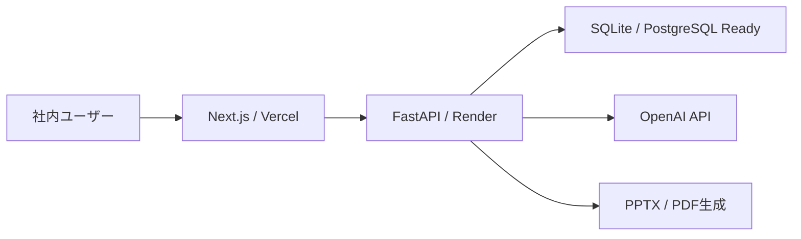

# ARCHITECTURE

## 構成図



## Backend責務

- `routers`: API境界、認証・権限チェック
- `services`: 業務ロジック
- `repositories`: DB操作
- `db.py`: DB接続、初期化、不足列補完
- `prompts/`: Prompt Registry、Version、Experiment
- `learning/`: Learning Engine
- `analytics/`: Product Analytics

## 主要DB

- users
- customers
- projects
- proposal_histories
- workspace_conversations
- action_queue
- proposal_reviews
- quality_gates
- proposal_knowledge
- analytics_sessions / analytics_events / analytics_errors
- learning_runs / learning_improvements
- prompt_versions / experiments / experiment_assignments / prompt_experiment_metrics
- integration_settings / external_intake_items / dry_run_logs
- release_records

## Import注意

- 旧提案生成Promptは `proposal_prompts.py`
- Prompt Registryは `app/prompts/`
- `schemas/` はパッケージとして維持
- `prompts.py` と `prompts/` の同居は避ける

## API一覧の確認

ルーターは `backend/app/routers/` に集約しています。管理系APIはBackend側でも必ず `require_roles` で権限を確認します。

## Version 22 Production Architecture Refactoring

Version 22??????????????UI/API/DB???????????????????????????????

### Frontend

```text
frontend/app/globals.css
  -> frontend/app/styles/variables.css
  -> frontend/app/styles/layout.css
  -> frontend/app/styles/dashboard.css
  -> frontend/app/styles/copilot.css
  -> frontend/app/styles/admin.css
  -> frontend/app/styles/presentation.css
  -> frontend/app/styles/responsive.css

frontend/components/AppShell.tsx
  -> frontend/components/app-shell/types.ts
```

`globals.css` ?CSS?????????????????????????????`AppShell.tsx` ???????????????????????????????

### Backend

```text
backend/app/db.py
  -> backend/app/database/connection.py
  -> backend/app/database/schema.py
  -> backend/app/database/startup.py
  -> backend/app/database/migration.py
  -> backend/app/database/health.py

backend/app/main.py
  -> backend/app/router_registry.py
  -> backend/app/health.py

backend/app/services/pptx_service.py
  -> backend/app/services/pptx_theme.py
```

`app.db` ???import???Facade??????????Router?Service?Repository??????????????????

### Repository??

?? `analytics/`, `knowledge/`, `learning/`, `prompts/`, `workspace/`, `beautiful_ai/` ???????????????????`backend/app/repositories.py` ??Pilot?CRM????????????????????????????Version 23?????? `ProjectRepository`, `ReviewRepository`, `UserRepository`, `PilotRepository`, `OperationRepository` ?????????
# Version 22.1 Internal Decomposition

Version 22.1 keeps the external architecture unchanged and splits large internal files for maintainability.

Frontend:

- `frontend/components/AppShell.tsx` remains the screen composition shell.
- Pure helper logic now lives under `frontend/components/app-shell/logic-parts/`.
- `frontend/components/app-shell/logic.ts` is the compatibility facade.

Backend:

- `backend/app/repositories.py` is now a facade.
- Domain repository implementation lives under `backend/app/repository_parts/`.
- `backend/app/services/pptx_service.py` remains the PPTX public service.
- PPTX content, drawing, and model helpers live under `backend/app/services/pptx_parts/`.

No API route, DB table, DB column, migration, or UI contract was added for this decomposition.
# Version 22.2 Architecture Note

- `AppShell.tsx` was decomposed into focused UI sections under `frontend/components/app-shell/sections/` without changing UI, API, DB, IDs, or permissions.
- PPTX generation keeps `backend/app/services/pptx_service.py` as the import-compatible facade and moves slide rendering into `backend/app/services/pptx_parts/slides.py`.
- See `docs/APPSHELL_UI_DECOMPOSITION.md`, `docs/PPTX_VISUAL_REGRESSION.md`, and `docs/V22_2_REFACTORING_RESULTS.md`.
## Version 23.0 Guided Flow Components

一般利用者向けの導線を以下へ分割しました。API、DB、Backend仕様は変更していません。

```text
frontend/components/guided-flow/
  GuidedFlow.tsx
  StepNavigation.tsx
  StepFooter.tsx
  BeautifulAiSimpleCard.tsx
  SimpleErrorMessage.tsx
  types.ts

frontend/app/styles/guided-flow.css
```

`AppShell.tsx` は既存状態と既存関数をGuidedFlowへ渡します。Quality Gate完了、PPT/PDF出力、Beautiful.ai作成は既存APIと既存関数を再利用します。
