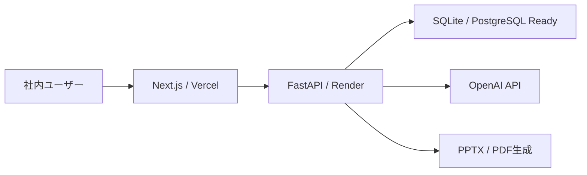

# ARCHITECTURE

## 構成図

## Backend責務

- `routers`: API境界、認証・権限チェック
- `services`: 業務ロジック
- `repositories`: DB操作
- `db.py`: DB接続、初期化、不足列補完
- `prompts/`: Prompt Registry、Version、Experiment
- `learning/`: Learning Engine
- `analytics/`: Product Analytics

## 主要DB

- users
- customers
- projects
- proposal_histories
- workspace_conversations
- action_queue
- proposal_reviews
- quality_gates
- proposal_knowledge
- analytics_sessions / analytics_events / analytics_errors
- learning_runs / learning_improvements
- prompt_versions / experiments / experiment_assignments / prompt_experiment_metrics
- integration_settings / external_intake_items / dry_run_logs
- release_records

## Import注意

- 旧提案生成Promptは `proposal_prompts.py`
- Prompt Registryは `app/prompts/`
- `schemas/` はパッケージとして維持
- `prompts.py` と `prompts/` の同居は避ける

## API一覧の確認

ルーターは `backend/app/routers/` に集約しています。管理系APIはBackend側でも必ず `require_roles` で権限を確認します。
