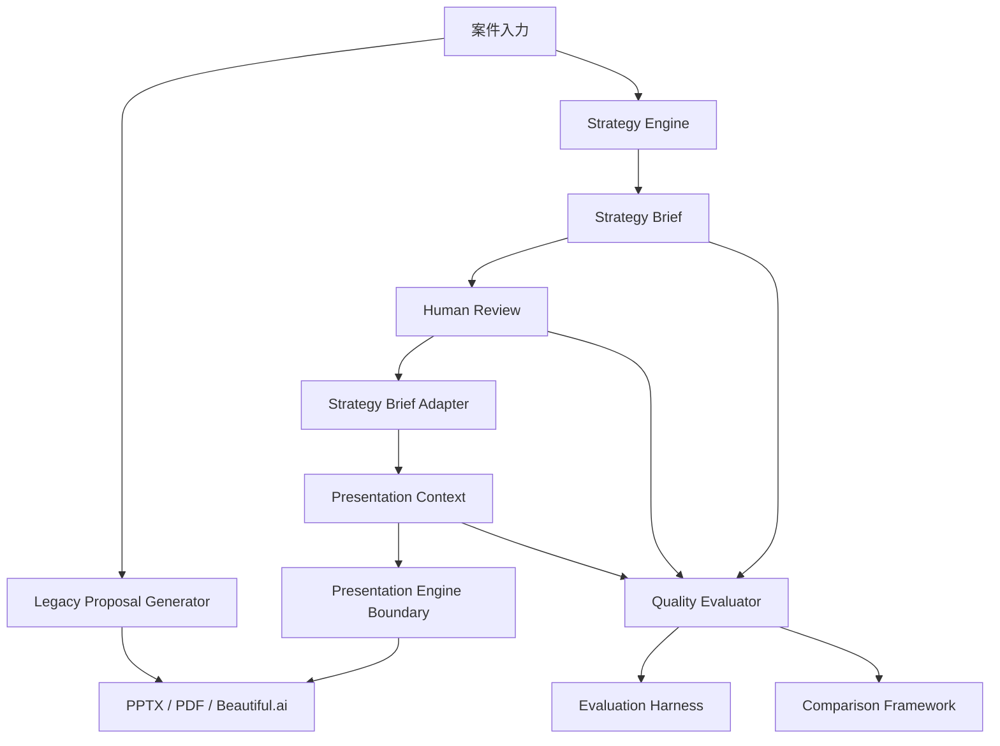

# AI Contributor Guide

この文書は、Codex・ChatGPTなどのAI開発者がProposalPilotを安全に理解し、改善に参加するためのガイドである。

## 1. Project Overview

ProposalPilot / AI営業秘書は、営業提案をAIで支援するアプリケーションである。

主な機能:

- 案件入力
- AI提案書生成
- 提出前チェック
- PPTX / PDF出力
- Beautiful.ai連携
- Presentation Review
- Proposal Optimization
- Organization / Workspace分離
- Role / Permission
- Strategy v1
- Human Review
- Quality Evaluator
- Evaluation Harness
- Comparison Framework

## 2. Project Purpose

目的は、営業担当が短時間で品質の揃った提案を作成できる状態をつくること。

RC1以降は、以下を優先する。

- 既存利用者への影響を出さない
- Legacy Engineを既定値として維持する
- Strategy v1はFeature Flagで段階利用する
- Human Reviewを通さず本番生成へ進めない
- 実案件評価をもとに改善する

## 3. Important Architecture



重要な考え方:

- Presentation EngineはStrategy Briefを直接受け取らない
- AdapterがPresentation Contextへ変換する
- Quality Evaluatorは生成結果を変更しない
- Evaluation HarnessとComparison Frameworkはオフライン評価基盤である
- 本番は `legacy` 既定値を維持する

## 4. Places AI May Change

依頼内容に明示されている場合のみ変更してよい。

| Area | Examples |
|---|---|
| docs | ドキュメント追加、整理、リンク修正 |
| tests | 既存仕様を守る回帰テスト追加 |
| fixtures | 実顧客情報を含まない安全なfixture |
| isolated utilities | 本番フローに接続しない検証用CLIや集計 |

ただし、変更前に必ず影響範囲を確認する。

## 5. Restricted Areas

明示的な依頼がない限り変更禁止。

- Backend本番API
- Frontend UI
- DB schema
- Migration
- Strategy Engine判定ロジック
- Presentation Engine
- Proposal Generator
- PPTX生成ロジック
- Quality Evaluator採点ロジック
- OpenAI利用方法
- Beautiful.ai利用方法
- Feature Flag既定値
- Auth / Permission
- Organization / Workspace分離

## 6. Safe Development Rules

AI contributorは以下を守る。

- 本番ロジックを直接変更しない
- Feature Flagを維持する
- Legacy既定値を変更しない
- 既存テストを削除・緩和しない
- `git add .` を使わない
- 変更範囲を最小化する
- 秘密情報を表示・保存しない
- 実顧客名、個人情報、顧客本文全文をfixtureやdocsに入れない
- DB変更はMigrationとRollback計画なしに行わない
- push前に差分と秘密情報候補を確認する
- 実行していないテストを成功と書かない
- クラウド未確認項目を成功扱いしない

## 7. Feature Flag Operation

Strategy v1はFeature Flagで段階利用する。

```text
PRESENTATION_ENGINE_MODE=legacy
PRESENTATION_ENGINE_MODE=strategy_v1
```

ルール:

- 既定値は `legacy`
- 無効値は `legacy` 扱い
- `strategy_v1` は明示的に有効化した場合のみ使う
- 不具合時は `legacy` へ戻す
- Human Review未承認のStrategy BriefをPresentation Contextへ渡さない

## 8. Test Commands

Backend:

```powershell
cd backend
.\.venv\Scripts\python.exe -m compileall app tests
.\.venv\Scripts\python.exe -m pytest -q
.\.venv\Scripts\python.exe -m pip check
```

Frontend:

```powershell
cd frontend
npm.cmd run typecheck
npm.cmd run check:unused
npm.cmd run build
npm.cmd run test:e2e
```

Common:

```powershell
git diff --check
git status --short
```

Strategy CLI:

```powershell
cd backend
.\.venv\Scripts\python.exe -m app.strategy_engine.cli --review ai_ocr
.\.venv\Scripts\python.exe -m app.strategy_engine.cli --evaluate ai_ocr
.\.venv\Scripts\python.exe -m app.strategy_engine.cli --benchmark
.\.venv\Scripts\python.exe -m app.strategy_engine.cli --compare ai_ocr
```

## 9. Review Procedure

PR前またはcommit前に以下を確認する。

### Scope

- [ ] 依頼された範囲だけを変更した
- [ ] 本番生成ロジックへ不要に触れていない
- [ ] UI変更が必要な依頼か確認した
- [ ] DB変更が必要な依頼か確認した

### Safety

- [ ] APIキー、Password、Tokenを含めていない
- [ ] 実顧客情報を含めていない
- [ ] Feature Flag既定値を変えていない
- [ ] Legacy fallbackを壊していない

### Tests

- [ ] 必要なBackendテストを実行した
- [ ] 必要なFrontendテストを実行した
- [ ] `git diff --check` を実行した
- [ ] 実行していない項目は未実行と明記する

### Git

- [ ] `git add .` を使っていない
- [ ] stage対象を明示した
- [ ] `git diff --cached --name-status` を確認した
- [ ] commit messageが依頼内容に沿っている

## 10. Git Rules

原則:

- `git add .` 禁止
- force push禁止
- reset / restore / clean は依頼なしに実行しない
- unrelated changesを巻き込まない
- commit前にstage対象を確認する
- pushは認証可能な場合のみ

推奨確認:

```powershell
git status --short
git diff --check
git diff --cached --name-status
git diff --cached --check
```

## 11. Safe Prompt Examples

### Backlog修正

> `IMPROVEMENT_BACKLOG_TEMPLATE.md` の項目を、Pilot運用に合わせて整理してください。コード変更は禁止です。

### バグ修正

> このE2E失敗の原因を調査し、アプリ仕様が正しい場合はテストだけを最小修正してください。既存テストを削除・緩和しないでください。

### ドキュメント更新

> `docs/release/rc1/OPERATION_GUIDE.md` にFeature Flag確認手順を追記してください。コード変更は禁止です。

### テスト追加

> Strategy Engineの新しいfixtureに対するpytestを追加してください。本番ロジックは変更しないでください。

### リファクタリング

> 挙動を変えずに対象ファイルだけを分割してください。API、DB、UI、Feature Flagの仕様は変更しないでください。

### 読み取り専用監査

> コード変更せず、該当機能の依存関係とリスクだけを調査して報告してください。

## 12. Unsafe Prompt Patterns

AI contributorは以下の依頼を受けた場合、確認または拒否を検討する。

- 「ついでに便利な機能も追加して」
- 「既存テストが邪魔なら消して」
- 「Feature FlagなしでStrategy v1を本番化して」
- 「DBを直接書き換えて」
- 「git add . で全部commitして」
- 「APIキーをログに出して」
- 「実顧客データでfixtureを作って」

## 13. PR Review Checklist

- [ ] 変更目的が明確
- [ ] 変更範囲が最小
- [ ] 生成ロジックへの影響が説明されている
- [ ] Legacy互換が維持されている
- [ ] Feature Flagが維持されている
- [ ] Organization / Workspace分離に影響がない
- [ ] 権限境界に影響がない
- [ ] 秘密情報が含まれていない
- [ ] テスト結果が記録されている
- [ ] 未確認項目が明記されている
- [ ] rollback方法が必要に応じて記載されている

## 14. When Unsure

不明点がある場合は、実装を止めて以下を報告する。

- 分かったこと
- 不明なこと
- 影響範囲
- 選択肢
- 推奨案
- 追加で必要な確認

AI contributorは、推測で本番挙動を変更しない。
