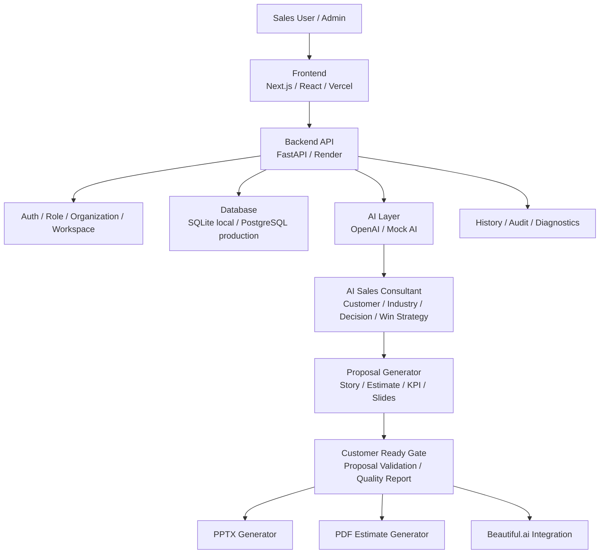
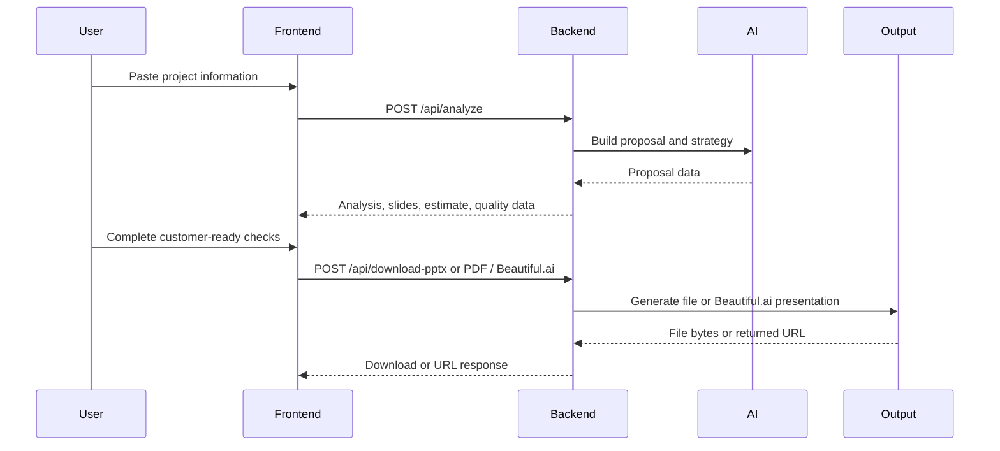
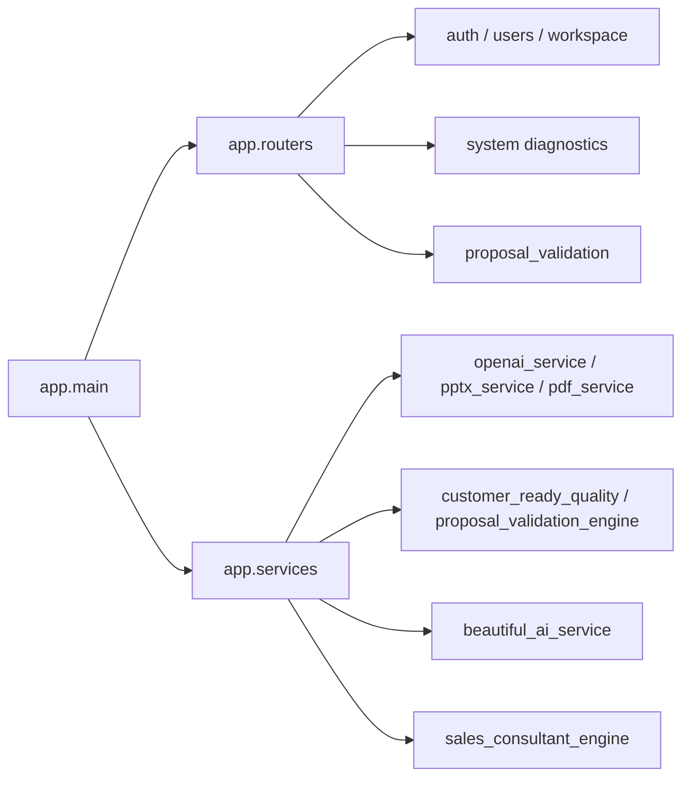
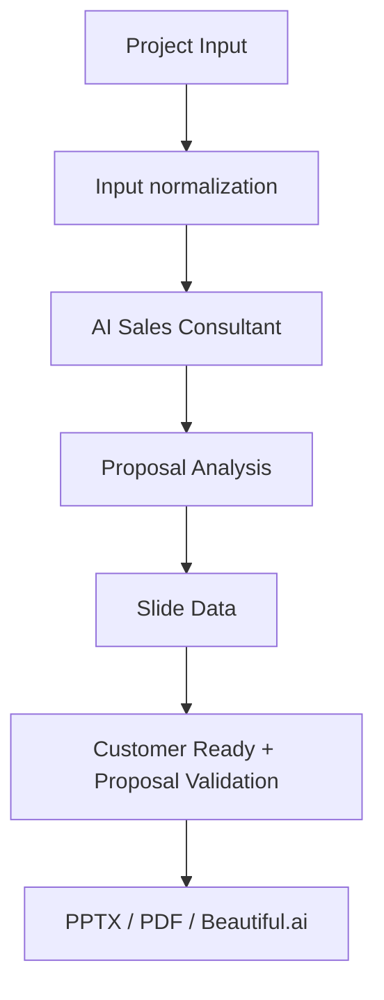
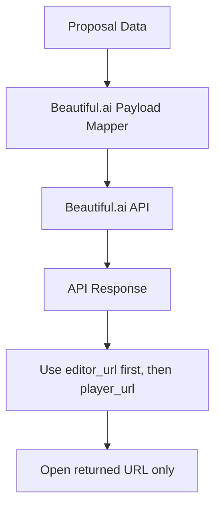

# System Architecture

## Overview

Ready Crew Proposal AI is a browser-based proposal creation service. The Frontend provides a guided workflow for sales users. The Backend handles authentication, workspace separation, AI proposal generation, quality validation, and output generation.

## High-Level Flow

## Runtime Components

| Component | Responsibility |
|---|---|
| Frontend | Login, guided proposal flow, result review, history, admin screens |
| Backend API | Request validation, authentication, authorization, service orchestration |
| Auth | Login, token status, role enforcement |
| Workspace | Organization and workspace scoped data |
| AI Services | OpenAI-backed or mock proposal generation |
| AI Sales Consultant | Internal strategy analysis before proposal output |
| Proposal Generator | Proposal content, slide data, estimate data |
| Customer Ready Gate | READY / REVIEW_REQUIRED / NOT_READY judgement |
| Proposal Validation | Multi-perspective proposal quality review |
| PPTX Generator | PowerPoint output |
| PDF Generator | Estimate PDF output |
| Beautiful.ai Service | Prompt API payload and URL handling |
| Diagnostics | Backend, DB, OpenAI, Beautiful.ai, auth, and frontend URL checks |

## Frontend to Backend

## Backend Modules

## AI Composition

## Beautiful.ai Boundary

The application must not generate Beautiful.ai editor URLs from `presentation_id` alone. It should use URLs returned by the Beautiful.ai API.

## Production Boundary

| Area | Production Rule |
|---|---|
| Secrets | Stored only in Render or Vercel environment variables |
| Database | PostgreSQL recommended |
| CORS | Allow production frontend URL only, plus required local origins for development |
| Feature Flags | Backend is the source of truth |
| Logs | Do not output API keys, passwords, tokens, or customer secrets |
| Rollback | Render previous deployment + Vercel previous deployment |

## Related Documents

- [Version 2.2 Release Notes](../releases/VERSION_2.2_RELEASE.md)
- [Production Deployment Guide](../deployment/PRODUCTION_DEPLOYMENT.md)
- [Administrator Guide](../manual/ADMIN_GUIDE.md)
