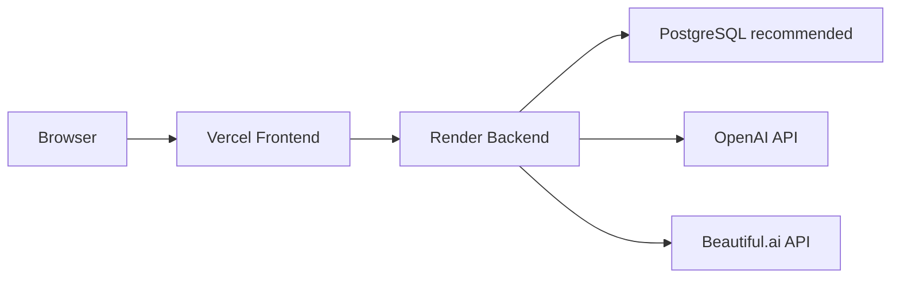

# Production Deployment Guide

## Purpose

This guide describes how to deploy Ready Crew Proposal AI to production as a web service using Render for Backend and Vercel for Frontend.

Do not store secrets in Git. Enter production secrets only in Render or Vercel environment settings.

## Production Topology



## Render Backend Deployment

1. Create a Render Web Service.
2. Connect the GitHub repository.
3. Set root directory to `backend`.
4. Use the build command:

```bash
pip install --upgrade pip && pip install -r requirements.txt
```

5. Use the start command:

```bash
uvicorn app.main:app --host 0.0.0.0 --port $PORT
```

6. Set health check path:

```text
/health/live
```

7. Set `APP_ENV=production`, `APP_AUTH_SECRET`, and `DATABASE_URL` in Render. Set `INITIAL_ADMIN_EMAIL` and `INITIAL_ADMIN_PASSWORD` only when the database has no administrator; the bootstrap never overwrites an existing user.
8. Set `CORS_ORIGINS` to the exact Vercel production origin. Do not use localhost, `*`, or a guessed Vercel URL.
9. Configure the remaining environment variables listed below.
10. Deploy.
11. Confirm `/health/live`, then `/health` and `/health/ready`.

## Vercel Frontend Deployment

1. Create a Vercel project.
2. Set root directory to `frontend`.
3. Use the default Next.js build command:

```bash
npm run build
```

4. Configure `NEXT_PUBLIC_API_URL` to the Render Backend URL.
5. Deploy.
6. Open the Vercel URL and confirm login.

## Backend Environment Variables

| Variable | Required | Example / Notes |
|---|---|---|
| `APP_ENV` | Yes | `production` |
| `APP_AUTH_SECRET` | Yes | Strong random secret. Never log or commit. |
| `INITIAL_ADMIN_EMAIL` | First deploy | Initial admin email. Used only when absent in DB. |
| `INITIAL_ADMIN_PASSWORD` | First deploy | Strong one-time admin password. Not overwritten later. |
| `DATABASE_URL` | Yes | PostgreSQL URL recommended. |
| `CORS_ORIGINS` | Yes | Exact Vercel production origin only; local origins are not accepted in production. |
| `CORS_ORIGIN_REGEX` | Development only | Not used for production; production requires explicit `CORS_ORIGINS`. |
| `OPENAI_API_KEY` | Production AI | Required when `USE_MOCK_AI=false`. |
| `OPENAI_MODEL` | Recommended | Example: `gpt-4.1-mini`. |
| `USE_MOCK_AI` | Yes | `false` for production AI. |
| `BEAUTIFUL_AI_ENABLED` | Optional | `true` when Beautiful.ai is used. |
| `BEAUTIFUL_AI_API_KEY` | Optional | Required when Beautiful.ai is enabled. |
| `BEAUTIFUL_AI_API_MODE` | Optional | `prompt` unless otherwise verified. |
| `BEAUTIFUL_AI_BASE_URL` | Optional | `https://www.beautiful.ai/api/v1`. |
| `BEAUTIFUL_AI_DEFAULT_THEME_ID` | Optional | Theme ID if managed. |
| `BEAUTIFUL_AI_TIMEOUT_SECONDS` | Optional | Example: `120`. |
| `BEAUTIFUL_AI_MOCK` | Optional | `false` in production. |
| `SALES_ASSISTANT_ENABLED` | Optional | Default `false`. |
| `SALES_ASSISTANT_PROPOSAL_ENABLED` | Optional | Default `false`. |
| `PROPOSAL_EXPORT_ENABLED` | Optional | Default `false`. |
| `MAINTENANCE_MODE` | Optional | `true` only during incidents. |

## Frontend Environment Variables

| Variable | Required | Example / Notes |
|---|---|---|
| `NEXT_PUBLIC_API_URL` | Yes | Render Backend URL. |
| `NEXT_PUBLIC_APP_VERSION` | Recommended | Example: `2.2.0-rc`. |
| `NEXT_PUBLIC_GIT_COMMIT` | Recommended | Build commit hash. |
| `NEXT_PUBLIC_GIT_BRANCH` | Optional | Build branch. |
| `NEXT_PUBLIC_BUILD_TIME` | Optional | Build timestamp. |
| `NEXT_PUBLIC_SALES_ASSISTANT_ENABLED` | Optional | UI display helper only. |
| `NEXT_PUBLIC_PROPOSAL_EXPORT_ENABLED` | Optional | UI display helper only. |

## Release Order

1. Prepare the Git repository and select the intended release commit.
2. Create the Render backend service from `render.yaml` and configure its Human-supplied values.
3. Deploy the backend and record its generated HTTPS URL.
4. Configure Vercel with `frontend` as the project root and set `NEXT_PUBLIC_API_URL` to that backend URL.
5. Deploy the frontend and record its production origin.
6. Update Render `CORS_ORIGINS` with that exact origin and redeploy/restart the backend if Render requires it.
7. Check `/health/live`, `/health`, and `/health/ready` without sending an AI request.
8. Run authentication, normal output, summary output, estimate PDF, and history smoke checks.
9. Run the M30 live smoke only after OpenAI billing and credentials are available.

Do not enable or change M30/M48, Shadow, Canary, or renderer flags as part of this handoff. Their values require a separate, explicit acceptance decision.

## API Keys

- Store OpenAI and Beautiful.ai keys only in Render environment variables.
- Do not add keys to `.env.example`, README, screenshots, logs, or issue reports.
- If a key is exposed, rotate it before release.

## Database

Recommended production setup:

1. Create Render PostgreSQL.
2. Set `DATABASE_URL` in Render Backend.
3. Deploy Backend.
4. Confirm `/health/ready`.
5. Confirm admin login.

SQLite is acceptable for local development. Production SQLite on non-persistent storage can be reset by redeploy, restart, or platform maintenance.

## Build Verification

Backend:

```powershell
cd backend
.\.venv\Scripts\python.exe -m pytest tests -q
.\.venv\Scripts\python.exe -m compileall app tests
.\.venv\Scripts\python.exe -m pip check
```

Frontend:

```powershell
cd frontend
npm.cmd run typecheck
npm.cmd run build
npm.cmd run test:e2e
```

## Startup Checks

After production deployment:

1. Open Backend `/health/live`.
2. Open Backend `/health` and `/health/ready`.
3. Open the Frontend Vercel URL.
4. Login as admin and member.
5. Run normal proposal and output/history smoke checks.
6. Run M30 live smoke only after OpenAI billing is restored.

## Smoke Test Checklist

- Admin login succeeds.
- Member login succeeds.
- Viewer cannot access admin menu.
- Proposal generation succeeds.
- Customer Ready result is displayed.
- Quality Report is visible.
- PowerPoint download succeeds.
- PDF estimate download succeeds.
- Beautiful.ai button is enabled only when configured.
- Generated Beautiful.ai URL opens when returned by API.
- History appears in the user screen.
- Audit log records key operations.

## Rollback

Backend rollback:

1. Open Render service deployments.
2. Select the previous successful deployment.
3. Redeploy the previous version.
4. Confirm `/health/ready`.
5. Run smoke tests.

Frontend rollback:

1. Open Vercel deployments.
2. Promote the previous working deployment.
3. Confirm the Vercel URL.
4. Run login and proposal smoke tests.

Operational rollback:

1. Set `MAINTENANCE_MODE=true` if users must stop new operations.
2. Disable optional features by setting feature flags to `false`.
3. Keep generated files and logs for incident review.
4. Do not delete production data during rollback.

## Markdown Link Check

The release documentation was checked using a repository-local Markdown link scan. The scan validates relative links to repository files and ignores external URLs.

If rerunning manually, use a small script that scans `*.md` files, extracts relative Markdown links, and verifies that each target file exists from the source document directory.
