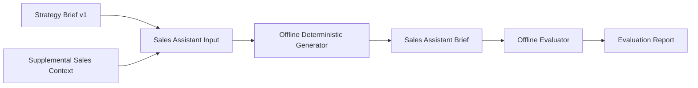

# Architecture

The Sales Assistant is a downstream consumer of Strategy Brief. It never re-runs project category, persona, strategy, story, or pack selection. Those decisions remain owned by the Proposal Strategy Engine.

## Isolation

The package is placed under `backend/app/sales_assistant/` to keep it independent from production presentation generation. It has no router, no database model, no migration, no frontend entry point, and no external API client.

