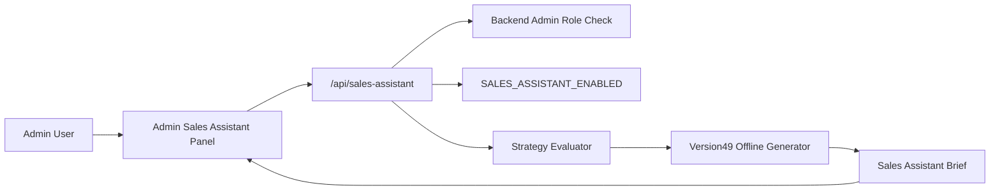

# Architecture

## Principles

- The UI is mounted inside the existing admin console.
- No Next.js route handler is added.
- The backend API is disabled by default.
- The backend remains the authority for access control.
- The generator remains deterministic and offline.
- No generated output is persisted.

## Data Flow

1. Admin opens the hidden-by-default panel.
2. Frontend calls `GET /api/sales-assistant/status`.
3. Admin enters sales context.
4. Frontend calls `POST /api/sales-assistant/generate`.
5. Backend evaluates a Strategy Brief from submitted context.
6. Backend calls the Version49 offline generator.
7. Backend returns a Sales Assistant Brief and review metadata.

## Isolation

The feature is isolated from:

- Proposal generation
- Presentation Engine
- PPTX generation
- Beautiful.ai
- OpenAI
- DB writes
