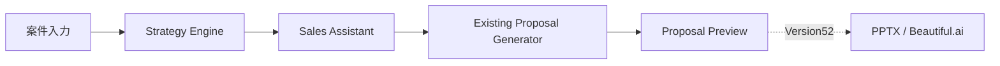

# Version 51 Sales Assistant to Proposal Pipeline Integration

Version 51 connects the admin-only AI Sales Assistant result to the existing Proposal Generator and returns a read-only Proposal Preview.

The integration is guarded by `SALES_ASSISTANT_PROPOSAL_ENABLED=false` by default. It does not generate PPTX, Beautiful.ai presentations, emails, history records, learning data, dashboards, DB rows, or migrations.

## Flow

## Files

- `api_contract.md`
- `pipeline.md`
- `frontend_ui.md`
- `feature_flag.md`
- `testing.md`
- `version52_plan.md`

## Compatibility

- Version 41 Strategy Brief is reused and returned by `/api/sales-assistant/generate`.
- Version 49 Sales Assistant Brief is reused as the primary sales context.
- Version 50 UI remains admin-only and feature-flagged.
- Existing Proposal Generator service is reused; proposal logic is not duplicated.
