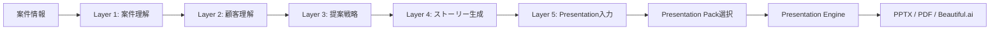
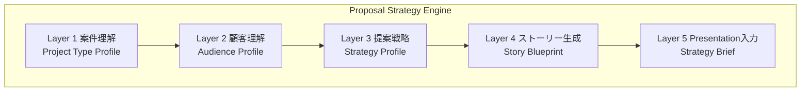
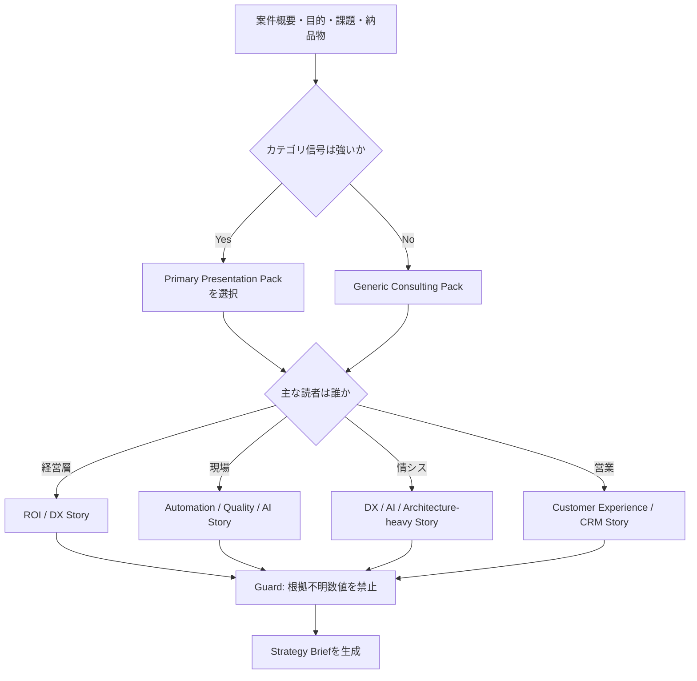
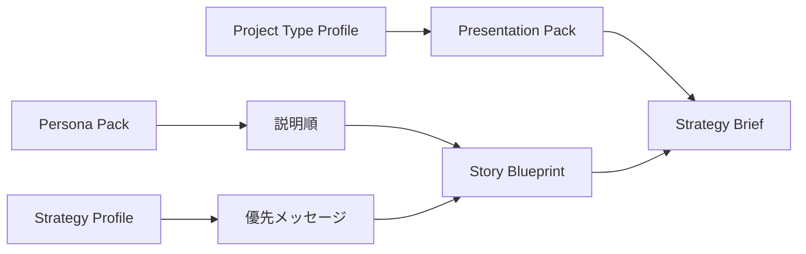
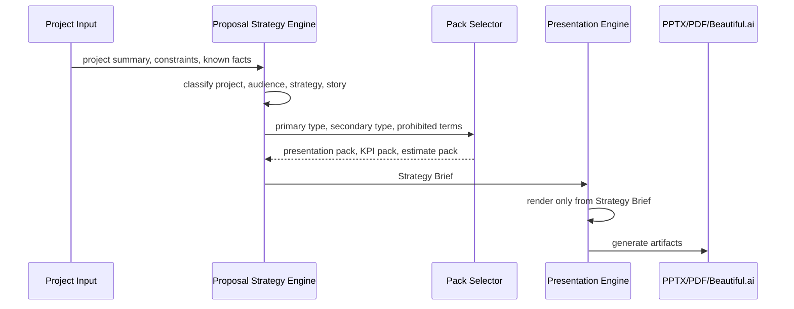
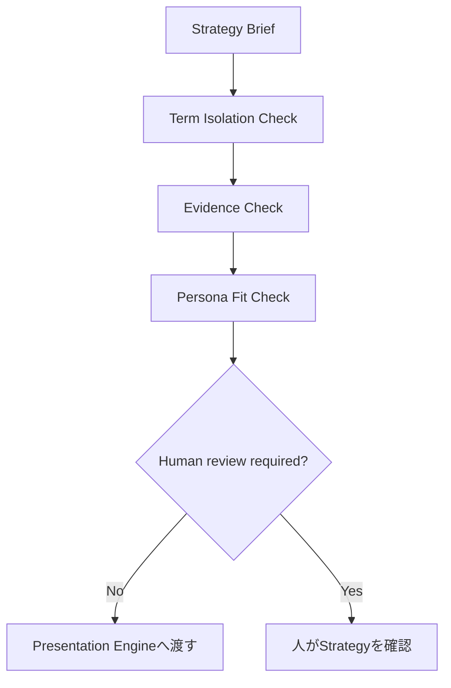
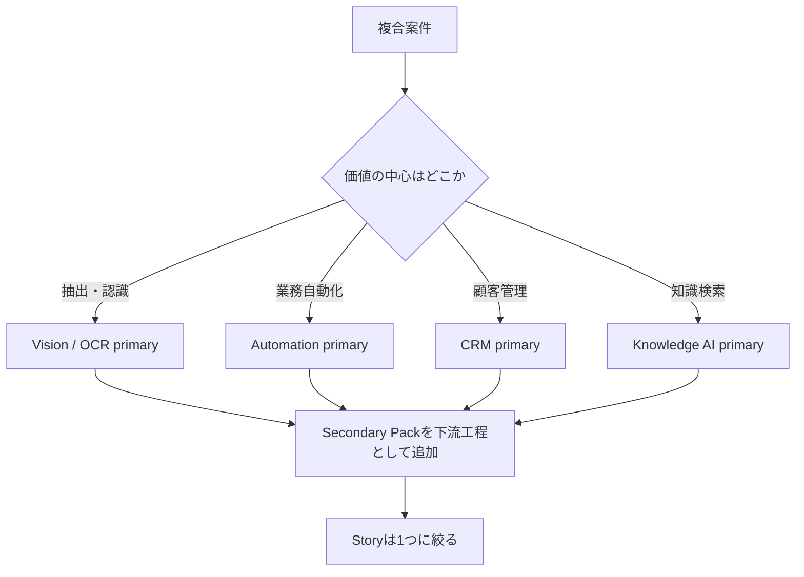

# Proposal Strategy Engine Flow Diagrams

Version: 40.0
Status: Design only. No production implementation.

## 1. Overall Flow

## 2. Five-Layer Structure

## 3. Decision Flow

## 4. Persona and Story Interaction

## 5. Presentation Engine Contract

## 6. Guardrail Flow

## 7. Compound Project Handling

