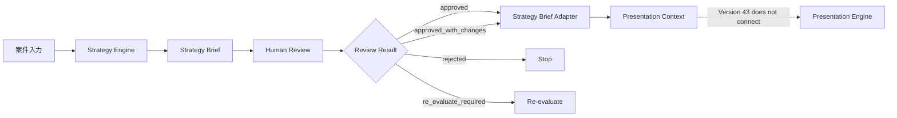

# Version 43 Flow

Status: Bridge Layer flow only.

## Flow



## Version 43 Stop Point

Version 43 stops after Presentation Context generation.

It does not call Presentation Engine or PPTX generation.

## Version 44 Candidate

Future integration may allow:

```text
Approved Presentation Context
-> Presentation Engine input
-> PPTX generation
```

Only after human approval and regression testing.
