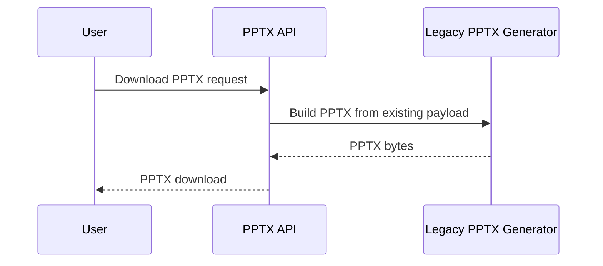
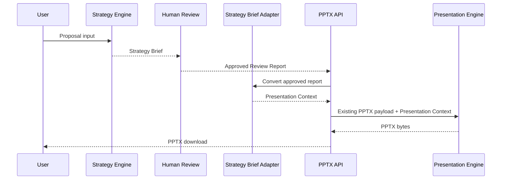

# Engine Sequence

## Legacy Mode

Legacy mode does not call Strategy Engine, Human Review, Strategy Adapter, or Presentation Context generation.

## Strategy v1 Mode

Presentation Engine receives only Presentation Context. It must not receive Strategy Brief directly.

## Logging

The bridge logs:

- Engine Mode
- Strategy Version
- Presentation Context Version
- Presentation Pack
- Story
- Persona

It does not log full customer input, prompt text, API keys, or authorization tokens.
