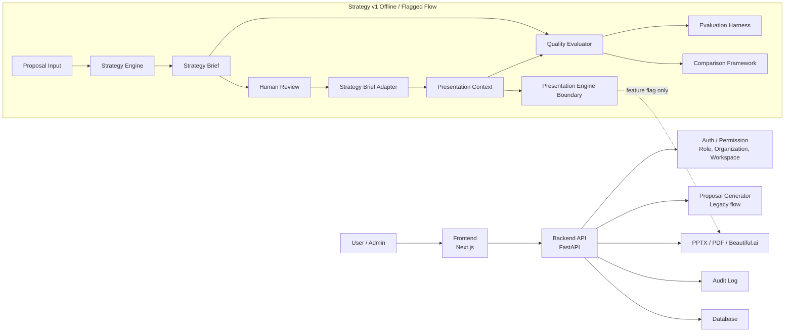

# Architecture Guide

ProposalPilotは、営業提案の入力、戦略設計、レビュー、PPTX/PDF/Beautiful.ai出力、品質評価、運用監査を扱うアプリケーションである。

## High Level Architecture



## Core Components

### Strategy Engine

案件情報から、案件カテゴリ、Persona、Strategy、Story、Presentation Packなどを決定する。

主なファイル:

- `backend/app/strategy_engine/evaluator.py`
- `backend/app/strategy_engine/rules.py`
- `backend/app/strategy_engine/models.py`
- `backend/app/strategy_engine/enums.py`

### Human Review

Strategy Briefを営業担当が確認し、Approve / Approve with Changes / Reject / Re-evaluateを判断する。

主なファイル:

- `backend/app/strategy_engine/review.py`
- `backend/app/strategy_engine/models.py`

### Adapter

Approve済みのStrategy Brief Review ReportをPresentation Contextへ変換する。

主なファイル:

- `backend/app/strategy_engine/adapter.py`

### Presentation Context

Presentation Engineへ渡すための専用データ構造。Presentation EngineはStrategy Briefを直接扱わない。

主なモデル:

- `PresentationContext`

### Presentation Engine

Feature FlagによりLegacy EngineまたはStrategy v1の経路を選ぶ境界層。

主なファイル:

- `backend/app/services/presentation_engine_integration.py`

### PPT Generator

既存のPPTX生成ロジック。Strategy v1でも最終的には互換情報を渡して既存生成を利用する。

主なファイル:

- `backend/app/services/pptx_service.py`
- `backend/app/services/pptx_parts/`
- `backend/app/services/pptx_design/`

### Quality Evaluator

Strategy Brief、Human Review Report、Presentation Contextを評価し、Proposal Quality Reportを生成する。

主なファイル:

- `backend/app/strategy_engine/quality.py`
- `backend/app/strategy_engine/quality_fixtures.py`

### Evaluation Harness

複数カテゴリの評価データセットをまとめて評価し、Markdown / JSON / CSVでレポートを出す。

主なファイル:

- `backend/app/strategy_engine/benchmark.py`
- `backend/app/strategy_engine/benchmark_dataset.py`

### Comparison Framework

同一案件についてLegacyとStrategy v1のQuality Reportを比較し、営業担当がレビューできる比較レポートを作る。

主なファイル:

- `backend/app/strategy_engine/comparison.py`

## Feature Flag

Strategy v1はFeature Flagで段階利用する。

```text
PRESENTATION_ENGINE_MODE=legacy
PRESENTATION_ENGINE_MODE=strategy_v1
```

既定値は `legacy`。無効値も `legacy` に戻る。

## Data Safety

- APIキー、Password、Tokenはログ・レポートへ出さない
- 実顧客本文全文は評価fixtureやPilot資料へ保存しない
- Organization / Workspace分離は本番API側で維持する
- Strategy v1の評価基盤はDB保存しない
