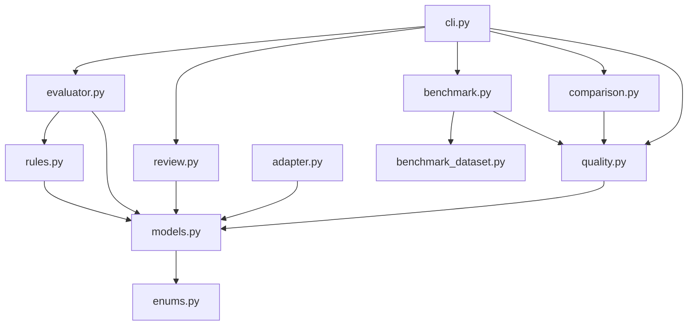
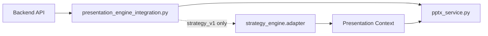

# Module Dependencies

ProposalPilotは、生成・評価・運用の責務を分離して循環参照を避ける。

## Strategy Engine Dependencies

## Production Boundary

## Dependency Rules

- Strategy Engineは外部AIサービスを直接呼ばない
- Quality EvaluatorはPPT生成結果を書き換えない
- Evaluation HarnessはDBへ保存しない
- Comparison Frameworkは本番Engineを切り替えない
- Presentation EngineはStrategy Briefを直接受け取らず、Presentation Contextだけを見る
- Legacy既定値を維持し、Strategy v1はFeature Flag経由でのみ使う

## 循環参照を避ける方針

- `models.py` は共通データ構造のみを持つ
- `evaluator.py` は `adapter.py` や `quality.py` を呼ばない
- `adapter.py` は評価や比較を行わない
- `quality.py` はStrategyを再判定しない
- `benchmark.py` と `comparison.py` はCLI/テスト向けのオフライン層として扱う
- production APIからbenchmark/comparisonを呼ばない

## 守るべき境界

| Boundary | Rule |
|---|---|
| Strategy Engine | 案件理解と戦略決定のみ |
| Human Review | 人の承認とOverride管理のみ |
| Adapter | Review ReportからPresentation Contextへの一方向変換のみ |
| Presentation Engine | Feature Flag選択とPPT Generatorへの橋渡しのみ |
| Quality Evaluator | 品質評価のみ |
| Evaluation Harness | 集計のみ |
| Comparison Framework | 比較レポートのみ |
