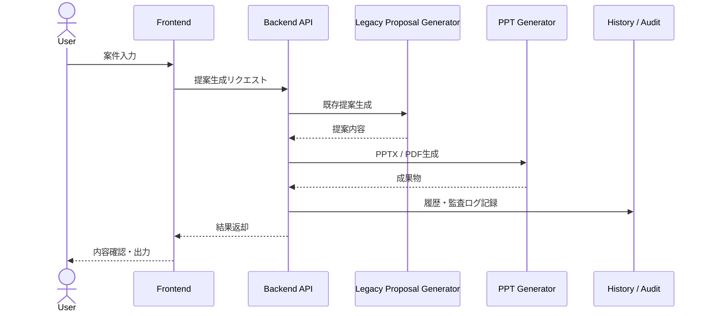
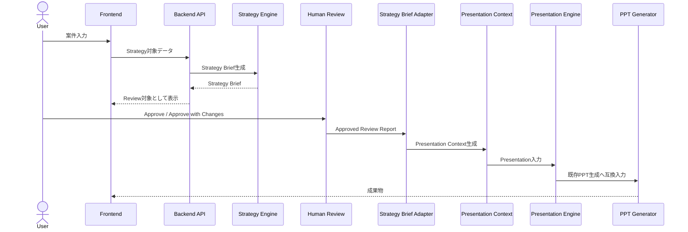
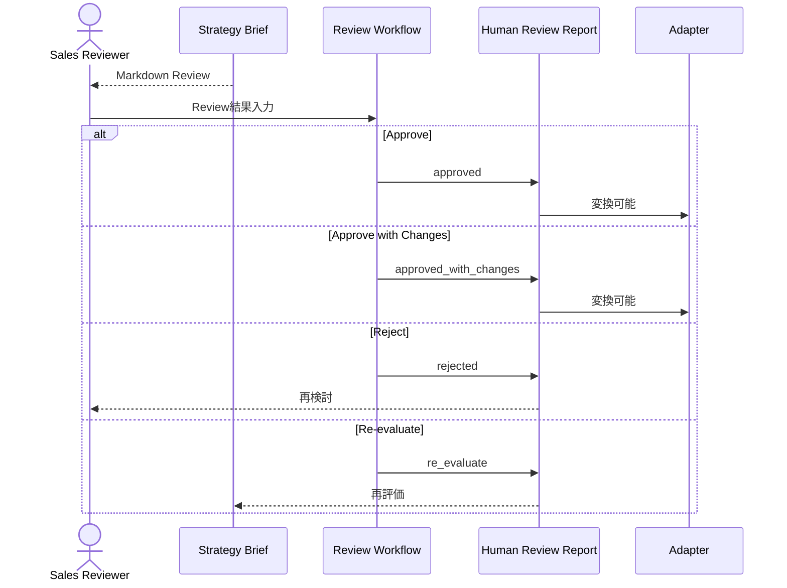
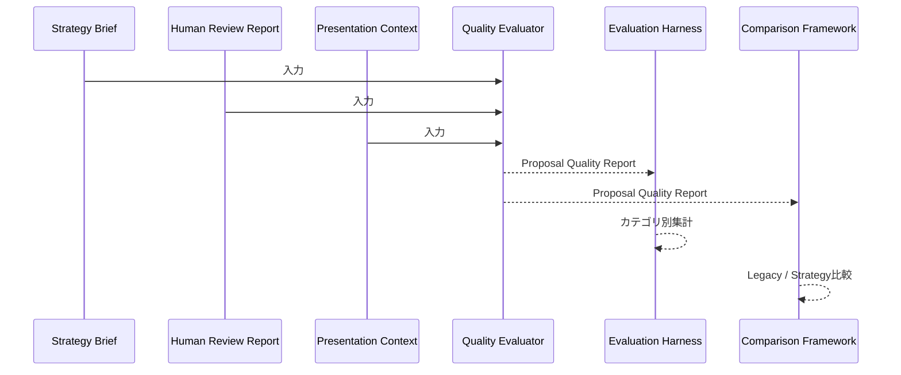

# Sequence Diagrams

## Legacy Flow

```mermaid
sequenceDiagram
    actor User
    participant FE as Frontend
    participant API as Backend API
    participant Legacy as Legacy Proposal Generator
    participant PPT as PPT Generator
    participant Store as History / Audit

    User->>FE: 案件入力
    FE->>API: 提案生成リクエスト
    API->>Legacy: 既存提案生成
    Legacy-->>API: 提案内容
    API->>PPT: PPTX / PDF生成
    PPT-->>API: 成果物
    API->>Store: 履歴・監査ログ記録
    API-->>FE: 結果返却
    FE-->>User: 内容確認・出力
```

## Strategy v1 Flow

```mermaid
sequenceDiagram
    actor User
    participant FE as Frontend
    participant API as Backend API
    participant Strategy as Strategy Engine
    participant Review as Human Review
    participant Adapter as Strategy Brief Adapter
    participant Context as Presentation Context
    participant Engine as Presentation Engine
    participant PPT as PPT Generator

    User->>FE: 案件入力
    FE->>API: Strategy対象データ
    API->>Strategy: Strategy Brief生成
    Strategy-->>API: Strategy Brief
    API-->>FE: Review対象として表示
    User->>Review: Approve / Approve with Changes
    Review->>Adapter: Approved Review Report
    Adapter->>Context: Presentation Context生成
    Context->>Engine: Presentation入力
    Engine->>PPT: 既存PPT生成へ互換入力
    PPT-->>FE: 成果物
```

## Human Review Flow

```mermaid
sequenceDiagram
    actor Sales as Sales Reviewer
    participant Brief as Strategy Brief
    participant Review as Review Workflow
    participant Report as Human Review Report
    participant Adapter as Adapter

    Brief-->>Sales: Markdown Review
    Sales->>Review: Review結果入力
    alt Approve
        Review->>Report: approved
        Report->>Adapter: 変換可能
    else Approve with Changes
        Review->>Report: approved_with_changes
        Report->>Adapter: 変換可能
    else Reject
        Review->>Report: rejected
        Report-->>Sales: 再検討
    else Re-evaluate
        Review->>Report: re_evaluate
        Report-->>Brief: 再評価
    end
```

## Quality Evaluation Flow

```mermaid
sequenceDiagram
    participant Brief as Strategy Brief
    participant Review as Human Review Report
    participant Context as Presentation Context
    participant Quality as Quality Evaluator
    participant Bench as Evaluation Harness
    participant Compare as Comparison Framework

    Brief->>Quality: 入力
    Review->>Quality: 入力
    Context->>Quality: 入力
    Quality-->>Bench: Proposal Quality Report
    Quality-->>Compare: Proposal Quality Report
    Bench-->>Bench: カテゴリ別集計
    Compare-->>Compare: Legacy / Strategy比較
```
