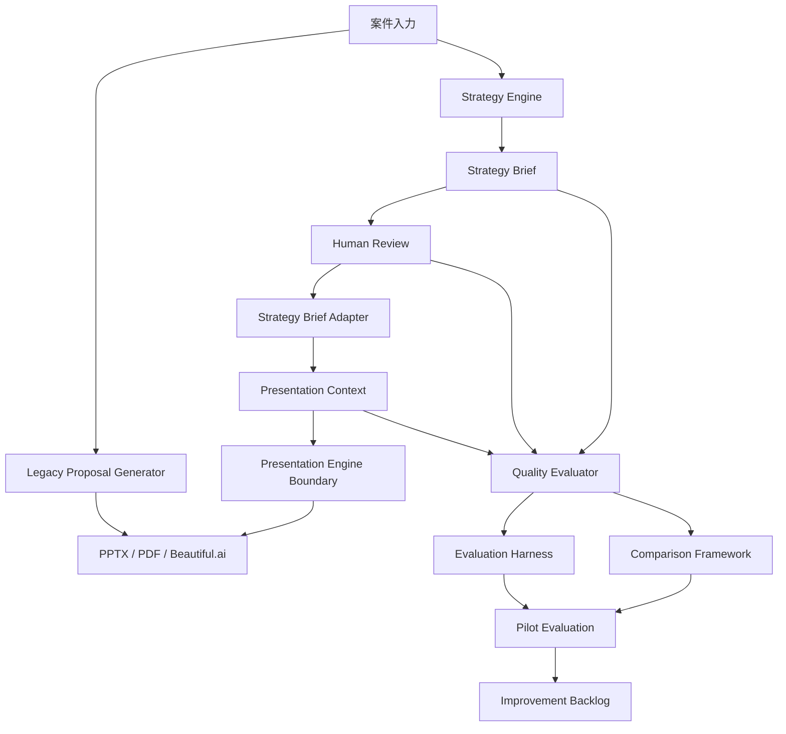
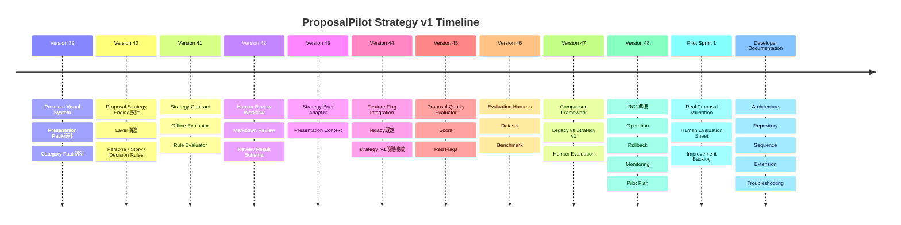

# ProposalPilot Book

ProposalPilot / AI営業秘書を、設計・運用・評価・開発の観点から一冊で理解するためのKnowledge Base。

## 1. ProposalPilotとは

ProposalPilotは、営業提案をAIで支援する営業オペレーションプラットフォームである。

案件入力から、提案書生成、提出前チェック、PowerPoint / PDF / Beautiful.ai出力、Presentation Review、Proposal Optimization、Strategy v1評価までを扱う。

Version39以降では、単なる「PowerPoint生成」から、以下を重視する構成へ進化した。

- 何を伝えるかを決めるStrategy Engine
- 人が確認・承認するHuman Review
- 生成前後の品質を評価するQuality Evaluator
- 実案件で継続評価するEvaluation Harness
- LegacyとStrategy v1を比較するComparison Framework
- RC1として安全に運用するRelease / Pilot資料

## 2. 目的

ProposalPilotの目的は、営業担当が短時間で、品質の揃った提案を作成できる状態をつくることである。

同時に、正式運用では以下を重視する。

- Legacy互換を維持する
- Strategy v1はFeature Flagで段階利用する
- Human Reviewを通さず本番生成へ進めない
- Quality ScoreとRed Flagで品質を見える化する
- 実案件Pilotで営業担当の評価を集める
- 不具合時はすぐLegacyへ戻せる

## 3. 全体構成

## 4. Architecture Summary

ProposalPilotは、既存のLegacy生成フローを維持しながら、Strategy v1を段階的に追加する構成である。

| Layer | Role | Main Docs |
|---|---|---|
| Frontend | 利用者UI、管理画面、ガイドUI | [UI Renewal](../V28_0_UI_RENEWAL.md) |
| Backend API | 認証、権限、生成、履歴、診断 | [Backend Architecture](../ARCHITECTURE.md) |
| Legacy Generator | 既存提案生成とPPT/PDF出力 | [Release Checklist](../PRODUCTION_CHECKLIST.md) |
| Strategy Engine | 案件理解、Persona、Story、Pack選定 | [Strategy Engine](../design/proposal-strategy-engine/PROPOSAL_STRATEGY_ENGINE.md) |
| Human Review | 営業担当の確認・修正・承認 | [Human Review](../design/proposal-strategy-engine/v42/HUMAN_REVIEW_WORKFLOW.md) |
| Adapter | Approved ReviewをPresentation Contextへ変換 | [Adapter Spec](../design/proposal-strategy-engine/v43/ADAPTER_SPEC.md) |
| Presentation Context | Presentation Engine専用入力 | [Presentation Context](../design/proposal-strategy-engine/v43/PRESENTATION_CONTEXT.md) |
| Presentation Engine | Feature FlagでLegacy / Strategy v1を選択 | [Feature Flag](../design/proposal-strategy-engine/v44/FEATURE_FLAG.md) |
| Quality Evaluator | 生成前品質評価とRed Flag検出 | [Quality Model](../design/proposal-strategy-engine/v45/QUALITY_MODEL.md) |
| Evaluation Harness | 複数案件の品質集計 | [Evaluation Harness](../design/proposal-strategy-engine/v46/README.md) |
| Comparison Framework | LegacyとStrategy v1の比較 | [Comparison Framework](../design/proposal-strategy-engine/v47/README.md) |
| RC1 / Pilot | 運用準備と実案件評価 | [RC1](../release/rc1/README.md), [Pilot](../pilot/README.md) |

## 5. Timeline

## 6. Version39〜48概要

| Version | Summary | Key Docs |
|---|---|---|
| 39 | Premium Visual PrototypeとPresentation Pack構想を整理 | [v39 Final Prototype](../design/presentation-prototypes/v39-final/REVIEW.md), [v39.3 Packs](../design/presentation-prototypes/v39-3-presentation-packs/PRESENTATION_PACK_ARCHITECTURE.md) |
| 40 | Proposal Strategy Engineを設計 | [Strategy Engine](../design/proposal-strategy-engine/PROPOSAL_STRATEGY_ENGINE.md), [Decision Rules](../design/proposal-strategy-engine/DECISION_RULES.md) |
| 41 | Strategy Brief契約とOffline Evaluatorを整備 | [Strategy Brief Schema](../design/proposal-strategy-engine/v41/STRATEGY_BRIEF_SCHEMA.md), [Rule Evaluator](../design/proposal-strategy-engine/v41/RULE_EVALUATOR.md) |
| 42 | Human Review Workflowを設計 | [Human Review Workflow](../design/proposal-strategy-engine/v42/HUMAN_REVIEW_WORKFLOW.md), [Review Result Schema](../design/proposal-strategy-engine/v42/REVIEW_RESULT_SCHEMA.md) |
| 43 | Strategy Brief AdapterとPresentation Contextを追加 | [Adapter Spec](../design/proposal-strategy-engine/v43/ADAPTER_SPEC.md), [Presentation Context](../design/proposal-strategy-engine/v43/PRESENTATION_CONTEXT.md) |
| 44 | Feature FlagでStrategy v1を段階接続 | [Feature Flag](../design/proposal-strategy-engine/v44/FEATURE_FLAG.md), [Integration Guide](../design/proposal-strategy-engine/v44/INTEGRATION_GUIDE.md) |
| 45 | Proposal Quality Evaluatorを追加 | [Quality Model](../design/proposal-strategy-engine/v45/QUALITY_MODEL.md), [Red Flags](../design/proposal-strategy-engine/v45/RED_FLAGS.md) |
| 46 | Evaluation Harnessを追加 | [Benchmark](../design/proposal-strategy-engine/v46/BENCHMARK.md), [Metrics](../design/proposal-strategy-engine/v46/METRICS.md) |
| 47 | Real Proposal Comparison Frameworkを追加 | [Comparison Report](../design/proposal-strategy-engine/v47/COMPARISON_REPORT.md), [Human Evaluation Schema](../design/proposal-strategy-engine/v47/HUMAN_EVALUATION_SCHEMA.md) |
| 48 | Strategy v1 RC1運用準備 | [RC1 Checklist](../release/rc1/RELEASE_CHECKLIST.md), [Operation Guide](../release/rc1/OPERATION_GUIDE.md) |

## 7. Pilot概要

Pilot Sprint 1は、実案件または安全なサンプル案件でStrategy v1を評価するための運用テンプレート群である。

| Template | Purpose |
|---|---|
| [Pilot README](../pilot/README.md) | Pilot全体の進め方 |
| [Pilot Dataset Template](../pilot/PILOT_DATASET_TEMPLATE.md) | 5〜10件の評価案件管理 |
| [Human Evaluation Template](../pilot/HUMAN_EVALUATION_TEMPLATE.md) | 営業担当の案件別評価 |
| [Pilot Summary Template](../pilot/PILOT_SUMMARY_TEMPLATE.md) | 複数案件の集計 |
| [Improvement Backlog Template](../pilot/IMPROVEMENT_BACKLOG_TEMPLATE.md) | 改善事項管理 |

Pilotでは、以下を確認する。

- LegacyとStrategy v1の比較
- Quality Score
- Red Flag
- 営業担当の理解しやすさ、説得力、修正量
- 実際に提出可能か
- 改善Backlogへ送るべき課題

## 8. Developer Guide概要

開発者・保守担当者向け資料は `docs/developer/` に集約している。

| Document | Purpose |
|---|---|
| [Developer README](../developer/README.md) | 開発者向け入口 |
| [Architecture](../developer/ARCHITECTURE.md) | 全体アーキテクチャ |
| [Repository Guide](../developer/REPOSITORY_GUIDE.md) | ディレクトリの役割 |
| [Sequence Diagrams](../developer/SEQUENCE_DIAGRAMS.md) | Legacy / Strategy / Review / Qualityの流れ |
| [Module Dependencies](../developer/MODULE_DEPENDENCIES.md) | 依存関係と境界 |
| [Extension Guide](../developer/EXTENSION_GUIDE.md) | 将来拡張の手順 |
| [Troubleshooting](../developer/TROUBLESHOOTING.md) | 開発時の問題対応 |

## 9. Document Inventory

### Architecture

- [Architecture](../ARCHITECTURE.md)
- [Architecture Score](../ARCHITECTURE_SCORE.md)
- [Developer Architecture](../developer/ARCHITECTURE.md)
- [Module Dependencies](../developer/MODULE_DEPENDENCIES.md)

### Strategy

- [Proposal Strategy Engine](../design/proposal-strategy-engine/PROPOSAL_STRATEGY_ENGINE.md)
- [Persona Packs](../design/proposal-strategy-engine/PERSONA_PACKS.md)
- [Story Packs](../design/proposal-strategy-engine/STORY_PACKS.md)
- [Decision Rules](../design/proposal-strategy-engine/DECISION_RULES.md)
- [v41 Strategy Brief Schema](../design/proposal-strategy-engine/v41/STRATEGY_BRIEF_SCHEMA.md)

### Presentation

- [Premium Design Guideline](../design/ProposalPilot_Premium_Design_Guideline_v1.md)
- [v39 Final Prototype Review](../design/presentation-prototypes/v39-final/REVIEW.md)
- [v39.1 Visual System](../design/presentation-prototypes/v39-1-premium-visual/VISUAL_SYSTEM.md)
- [v39.3 Presentation Pack Architecture](../design/presentation-prototypes/v39-3-presentation-packs/PRESENTATION_PACK_ARCHITECTURE.md)
- [Category KPI Packs](../design/presentation-prototypes/v39-3-presentation-packs/CATEGORY_KPI_PACKS.md)
- [Category Estimate Packs](../design/presentation-prototypes/v39-3-presentation-packs/CATEGORY_ESTIMATE_PACKS.md)

### Review

- [Human Review Workflow](../design/proposal-strategy-engine/v42/HUMAN_REVIEW_WORKFLOW.md)
- [Review Screen Spec](../design/proposal-strategy-engine/v42/REVIEW_SCREEN_SPEC.md)
- [Override Rules](../design/proposal-strategy-engine/v42/OVERRIDE_RULES.md)
- [Review Result Schema](../design/proposal-strategy-engine/v42/REVIEW_RESULT_SCHEMA.md)

### Quality

- [Quality Model](../design/proposal-strategy-engine/v45/QUALITY_MODEL.md)
- [Scoring](../design/proposal-strategy-engine/v45/SCORING.md)
- [Red Flags](../design/proposal-strategy-engine/v45/RED_FLAGS.md)
- [Quality Report Schema](../design/proposal-strategy-engine/v45/QUALITY_REPORT_SCHEMA.md)

### Evaluation

- [Evaluation Harness](../design/proposal-strategy-engine/v46/README.md)
- [Evaluation Dataset](../design/proposal-strategy-engine/v46/EVALUATION_DATASET.md)
- [Metrics](../design/proposal-strategy-engine/v46/METRICS.md)
- [Benchmark](../design/proposal-strategy-engine/v46/BENCHMARK.md)
- [Report Format](../design/proposal-strategy-engine/v46/REPORT_FORMAT.md)

### Comparison

- [Comparison Framework](../design/proposal-strategy-engine/v47/README.md)
- [Comparison Report](../design/proposal-strategy-engine/v47/COMPARISON_REPORT.md)
- [Human Evaluation Schema](../design/proposal-strategy-engine/v47/HUMAN_EVALUATION_SCHEMA.md)
- [Comparison Metrics](../design/proposal-strategy-engine/v47/METRICS.md)

### Release

- [RC1 README](../release/rc1/README.md)
- [RC1 Release Checklist](../release/rc1/RELEASE_CHECKLIST.md)
- [RC1 Operation Guide](../release/rc1/OPERATION_GUIDE.md)
- [RC1 Rollback Plan](../release/rc1/ROLLBACK_PLAN.md)
- [RC1 Monitoring Guide](../release/rc1/MONITORING_GUIDE.md)
- [RC1 Acceptance Criteria](../release/rc1/ACCEPTANCE_CRITERIA.md)
- [RC1 Pilot Plan](../release/rc1/PILOT_PLAN.md)

### Pilot

- [Pilot README](../pilot/README.md)
- [Pilot Dataset Template](../pilot/PILOT_DATASET_TEMPLATE.md)
- [Human Evaluation Template](../pilot/HUMAN_EVALUATION_TEMPLATE.md)
- [Pilot Summary Template](../pilot/PILOT_SUMMARY_TEMPLATE.md)
- [Improvement Backlog Template](../pilot/IMPROVEMENT_BACKLOG_TEMPLATE.md)

### Developer

- [Developer README](../developer/README.md)
- [Repository Guide](../developer/REPOSITORY_GUIDE.md)
- [Sequence Diagrams](../developer/SEQUENCE_DIAGRAMS.md)
- [Extension Guide](../developer/EXTENSION_GUIDE.md)
- [Troubleshooting](../developer/TROUBLESHOOTING.md)

### Brand / Sales

- [Brand Guide](../brand/01_BRAND_GUIDE.md)
- [Visual Guide](../brand/02_VISUAL_GUIDE.md)
- [Product Positioning](../brand/03_PRODUCT_POSITIONING.md)
- [Messaging](../brand/04_MESSAGING.md)
- [Sales Demo Scenario](../brand/06_DEMO_SCENARIO.md)
- [Product Roadmap](../brand/08_PRODUCT_ROADMAP.md)

## 10. Feature Matrix

| Area | V39 | V40 | V41 | V42 | V43 | V44 | V45 | V46 | V47 | V48 | Pilot |
|---|---|---|---|---|---|---|---|---|---|---|---|
| Premium Visual System | Added |  |  |  |  |  |  |  |  |  |  |
| Presentation Pack Design | Added |  |  |  |  |  |  |  |  |  |  |
| Proposal Strategy Engine Design |  | Added |  |  |  |  |  |  |  |  |  |
| Strategy Brief Contract |  |  | Added |  |  |  |  |  |  |  |  |
| Rule Evaluator |  |  | Added |  |  |  |  |  |  |  |  |
| Human Review Workflow |  |  |  | Added |  |  |  |  |  |  |  |
| Strategy Brief Adapter |  |  |  |  | Added |  |  |  |  |  |  |
| Presentation Context |  |  |  |  | Added |  |  |  |  |  |  |
| Feature Flag Integration |  |  |  |  |  | Added |  |  |  |  |  |
| Quality Evaluator |  |  |  |  |  |  | Added |  |  |  |  |
| Evaluation Harness |  |  |  |  |  |  |  | Added |  |  |  |
| Comparison Framework |  |  |  |  |  |  |  |  | Added |  |  |
| RC1 Operations |  |  |  |  |  |  |  |  |  | Added |  |
| Pilot Templates |  |  |  |  |  |  |  |  |  |  | Added |
| Developer Docs |  |  |  |  |  |  |  |  |  |  | Added |

## 11. Glossary

| Term | Meaning |
|---|---|
| Strategy Brief | 案件カテゴリ、Persona、Strategy、Story、Packなどをまとめた戦略設計結果 |
| Presentation Context | Presentation Engineへ渡す専用入力。Strategy Briefを直接渡さないための中間データ |
| Pack | 提案資料の構成や見せ方を決めるカテゴリ別テンプレート概念 |
| Story | 提案の説明順。ROI、DX、AI、Automation、Qualityなど |
| Persona | 提案先の主な読者。経営層、部長、現場責任者、情報システムなど |
| Human Review | 営業担当がStrategy Briefを確認、修正、承認する工程 |
| Review Report | Human Reviewの結果。Approve、Approve with Changes、Reject、Re-evaluateを含む |
| Adapter | Review ReportをPresentation Contextへ一方向変換する層 |
| Presentation Engine | Feature FlagによりLegacyまたはStrategy v1を選ぶ境界層 |
| Legacy Engine | 既存の提案生成・PPT生成フロー |
| Strategy v1 | Strategy Brief、Human Review、Presentation Contextを使う段階的な新フロー |
| Quality Report | Strategy Brief、Review Report、Presentation Contextを評価した結果 |
| Red Flag | Evidence不足、KPI不足、Risk不足など重大な品質課題 |
| Evaluation Harness | 複数案件をまとめて評価し、平均ScoreやGrade分布を出す仕組み |
| Comparison Framework | 同一案件についてLegacyとStrategy v1を比較する仕組み |
| Human Evaluation | 営業担当が理解しやすさ、説得力、修正量などを評価する欄 |
| RC1 | Release Candidate 1。限定運用できるか確認する段階 |
| Pilot Sprint | 実案件評価と改善Backlog整理を行う検証Sprint |
| Feature Flag | `PRESENTATION_ENGINE_MODE` によりLegacy / Strategy v1を切り替える設定 |
| Generic Fallback | 入力情報が不足した場合などに汎用提案カテゴリへ落とすこと |

## 12. Future Roadmap

今後の方向性は以下。

### Near Term

- Pilot Sprint 1で5〜10件の実案件評価を完了する
- Human Evaluationを集計する
- CriticalなRed Flagを分類する
- Strategy v1がLegacy以上に有効なカテゴリを見極める

### Mid Term

- Pilot結果をもとにStory / Persona / Pack選定ルールを改善する
- Quality Evaluatorの採点精度を改善する
- Human Review画面化を検討する
- Evaluation HarnessをCIレポートとして保存する

### Long Term

- Strategy v1の本番利用範囲を段階的に広げる
- 実案件評価データを匿名化して継続学習に活用する
- Presentation Packを実運用で磨き込む
- SaaS運用向けの監視、権限、監査、サポート体制を強化する

## 13. Reading Shortcuts

| Need | Read |
|---|---|
| 全体像を知りたい | このBookの1〜4章 |
| Version39〜48の流れを知りたい | Timeline / Version概要 |
| Strategy v1を運用したい | [RC1 Operation Guide](../release/rc1/OPERATION_GUIDE.md) |
| 実案件評価を始めたい | [Pilot README](../pilot/README.md) |
| 開発者として保守したい | [Developer README](../developer/README.md) |
| 拡張したい | [Extension Guide](../developer/EXTENSION_GUIDE.md) |
| 障害対応したい | [Troubleshooting](../developer/TROUBLESHOOTING.md) |
