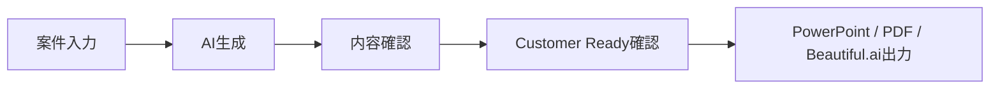

# Sales User Guide

## Purpose

This guide is for sales users who create customer proposals with Ready Crew Proposal AI.

## Basic Flow

## 1. Login

1. Open the application URL.
2. Select the user login tab.
3. Enter your email and password.
4. If login fails, confirm your account status with an administrator.

## 2. Start a New Proposal

1. Click `新しく提案書を作る`.
2. Paste project information into the large input field.
3. You can paste customer emails, meeting notes, hearing notes, or rough requirements.
4. Click `AIで提案書を作成`.

Good input examples:

- Customer name and industry
- Current issue
- Desired outcome
- Budget range
- Desired schedule
- Existing system or website
- Competitors or comparison targets
- Required deliverables

## 3. AI Generation

During generation, the app organizes:

- Customer situation
- Proposal story
- Slide structure
- KPI and estimate assumptions
- Risks and questions
- Output data for PowerPoint, PDF, and Beautiful.ai

Do not close the browser during generation.

## 4. Review Proposal Content

After generation, confirm:

- Project name
- Proposal summary
- Current issues
- Proposed solution
- Slide outline
- KPIs
- Estimate summary
- Risks and assumptions
- Next actions

If important customer facts are missing, add notes and regenerate or revise before sending.

## 5. Customer Ready

Customer Ready means the generated proposal has passed automated checks for customer-facing quality.

Check:

- Status is `READY` or equivalent customer-ready display.
- Required fixes are zero.
- No customer name or context is wrong.
- KPI and estimate assumptions are acceptable.
- Risks and next actions are clear.

Even when Customer Ready passes, do a final human review before external submission.

## 6. Quality Report

The Quality Report helps you review:

- Story consistency
- Customer understanding
- Executive value
- KPI quality
- Estimate and schedule clarity
- Risk coverage
- Visual and slide balance
- Expected customer questions

Use the report to prepare for customer questions.

## 7. PowerPoint Download

1. Complete the required pre-submission checks.
2. Click the PowerPoint download button.
3. Open the downloaded file.
4. Confirm the cover, summary, KPI, estimate, risks, and next action slides.
5. Save a customer-specific copy before manual edits.

## 8. PDF Estimate Download

1. Confirm estimate assumptions.
2. Click the PDF estimate download button.
3. Review price items, notes, and validity before sending.

## 9. Beautiful.ai

If Beautiful.ai is enabled:

1. Confirm the Beautiful.ai status is configured.
2. Complete required checks.
3. Click `Beautiful.aiで作成`.
4. The app opens the returned Beautiful.ai URL.
5. If only a view URL is returned, use it as a preview and ask an administrator if an edit URL is required.

If Beautiful.ai is not configured, use PowerPoint download instead.

## 10. History

Use the creation history to:

- Resume recent proposals.
- Review generation time.
- Download CSV history.
- Confirm past proposal outputs.

## FAQ

### The proposal cannot be generated.

Check your network connection and try again. If the issue continues, contact an administrator with the displayed request ID if available.

### Beautiful.ai says it is not configured.

Use PowerPoint download and ask an administrator to check Backend Beautiful.ai settings.

### The output button is disabled.

Complete the pre-submission checks. If a review is required, confirm missing items first.

### The proposal says assumptions are used.

Assumptions are not final facts. Confirm them with the customer before submission.

### Can I send the generated proposal as-is?

Only after Customer Ready passes and a sales user confirms customer-specific facts, prices, dates, and names.

## Final Submission Checklist

- Customer name is correct.
- Proposal objective is correct.
- Estimate conditions are correct.
- KPI assumptions are acceptable.
- Timeline is realistic.
- Risks are explained.
- No internal notes are included.
- PowerPoint opens correctly.
- PDF estimate opens correctly.
- Beautiful.ai URL opens if used.
