# Presentation Engine 2.0 Alpha Integration Review

Alpha Integration Review runs Phase 2A, Phase 2B, and Phase 2C offline:

```mermaid
flowchart LR
  A["Proposal Context"] --> B["Deck Planner"]
  B --> C["Deck Blueprint"]
  C --> D["Evidence Planner"]
  D --> E["Evidence Planner Output"]
  E --> F["Message Designer"]
  F --> G["Message Designer Output"]
  G --> H["Cross-module Validation"]
  H --> I["Integration Evaluation"]
  I --> J["Human Review Markdown"]
```

## Boundary

This review does not connect to Proposal generation, Version81 runtime, PPTX, Renderer, Slide Blueprint generation, Frontend, Backend API, DB, OpenAI, or Beautiful.ai.

## Status

The module is intended to judge readiness for Phase 2D, not to produce customer-facing PowerPoint.

