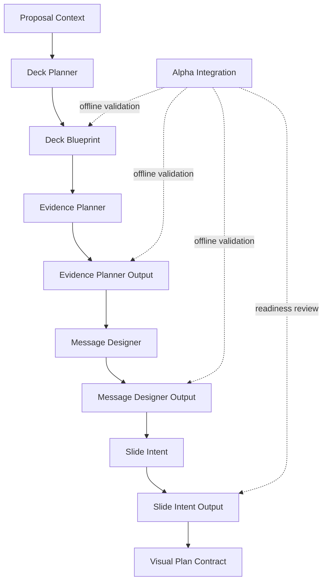

# Architecture Snapshot

## Alpha Architecture

## Responsibility Separation

| Layer | Responsibility |
|---|---|
| Proposal Context | Business input and customer situation. |
| Deck Planner | Deck goal, audience, section order, slide order, CTA, decision flow. |
| Evidence Planner | Required evidence, optional evidence, missing evidence warnings. |
| Message Designer | Headline, main message, supporting messages, evidence disclosure. |
| Slide Intent | Abstract visual intent, reading order, visual pattern candidate. |
| Visual Plan Contract | Contract for future visual strategy, not an engine. |
| Alpha Integration | Offline validation and quality review. |

## Boundary Snapshot

Alpha does not cross into:

- Visual Director implementation
- Blueprint Composer
- Renderer
- PPTX generation
- runtime proposal generation
- Version81 integration
- API / DB / Frontend

## Dependency Direction

Dependencies move forward only. Later layers may read earlier contract outputs.
Earlier layers must not read later layers.

No circular dependency is allowed.
