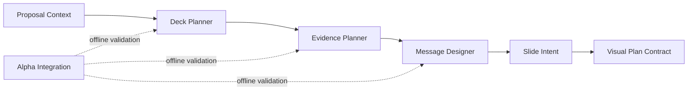

# Presentation Engine 2.0 Alpha Release Notes

## Release Name

Presentation Engine 2.0 Alpha

## Purpose

Presentation Engine 2.0 Alpha establishes the offline foundation for moving
from "PowerPoint generation" to "proposal message and presentation structure
design."

The Alpha release is intentionally not connected to production proposal
generation, Version81 runtime, API routes, databases, frontend screens, PPTX
rendering, OpenAI, or Beautiful.ai.

## Completed Scope

## Implemented Foundation

- Slide Blueprint Contract Foundation
- Deck Blueprint Foundation
- Deck Planner Offline Engine
- Evidence Planner Foundation
- Message Designer Foundation
- Slide Intent Foundation
- Alpha Integration Review Harness
- Visual Plan Contract Foundation
- Phase 3 Visual Director Readiness Review
- Architecture and developer handoff documents

## Release Value

Alpha gives future developers a typed, testable, offline pipeline for planning
sales proposal decks before any PowerPoint rendering is attempted.

## Not Included

- Visual Director Engine
- Blueprint Composer
- Renderer
- PPTX generation through Presentation Engine 2.0
- Runtime API
- Frontend UI
- DB persistence
- OpenAI or other external AI calls
- Beautiful.ai integration
- Version81 production integration

## Release Decision

Alpha is ready as a developer and architecture package. It is not a production
feature release.
