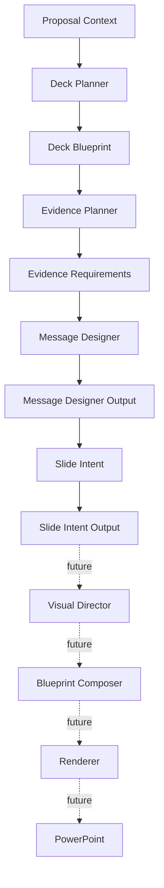

# Architecture Overview

## Purpose

Presentation Engine 2.0 is designed to move from "placing information into PowerPoint" to "designing the message and visual structure of a sales proposal."

The architecture separates strategy, evidence, message, visual intent, visual composition, and rendering so each module has a narrow responsibility.

## Core Philosophy

1. Strategy and story must be decided before visual design.
2. Evidence must be explicit before claims are written.
3. Message must be independent from layout.
4. Slide Intent bridges message and visual design.
5. Visual Director chooses visual expression, but does not write the proposal.
6. Blueprint Composer creates renderer-ready structure, but does not invent strategy.
7. Renderer draws only what the blueprint says.

## Frozen Architecture

## Responsibility Separation

Deck Planner decides what the deck should contain and in what order.

Evidence Planner decides what proof is required for each planned slide.

Message Designer decides the headline, main message, support points, and evidence disclosure.

Slide Intent decides what each slide should make visible and what abstract visual pattern may fit.

Visual Director will decide the concrete visual composition.

Blueprint Composer will convert visual composition into renderer-ready slide blueprint.

Renderer will draw PowerPoint objects without changing business meaning.

## Dependency Policy

Dependencies move forward only. Later modules may read earlier contracts. Earlier modules must not depend on later modules.

No circular dependency is allowed.

## Extension Policy

New capabilities should be added as versioned modules or versioned contracts. Existing frozen contracts should not be changed destructively.
