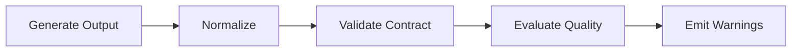

# Data Flow

## Stage Data

| Stage | Main Data | Validator | Normalizer | Evaluator |
|---|---|---|---|---|
| Proposal Context | project summary, industry, category, audience, problems, outcomes | Pydantic schema | text/list cleanup | none |
| Deck Planner | deck goal, sections, slide plan | deck validator | deck normalizer | deck evaluator |
| Evidence Planner | evidence requirements per slide | evidence contract checks | rule-based construction | evidence evaluator |
| Message Designer | headline, main message, support points | message validator | message normalizer | message evaluator |
| Slide Intent | intent, visual candidate, reading order | intent validator | intent normalizer | intent evaluator |
| Alpha Integration | cross-module output | cross-module validator | adapter | integration evaluator |

## Data Ownership

Each module owns its output contract. Downstream modules can reference upstream IDs but should not mutate upstream objects.

## ID Continuity

The following IDs must remain stable:

- `deck_id`
- `slide_blueprint_id`
- `message_design_id`
- `intent_id`
- evidence `requirement_id`

## Validation Flow

## Missing Data Handling

Missing information must be represented explicitly as a warning, disclosure, or validation issue. It must not be filled with fake numbers, fake customer proof, or invented results.
