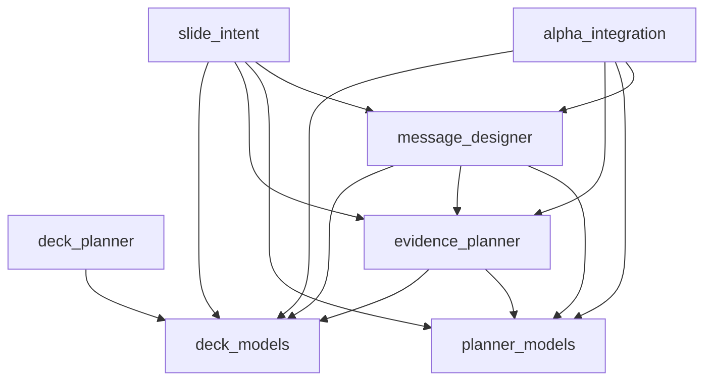

# Module Dependency

## Allowed Dependencies

## Write Boundaries

| Module | May Write |
|---|---|
| deck_planner | DeckPlannerResult, DeckBlueprint |
| evidence_planner | EvidencePlannerResult |
| message_designer | MessageDesignerOutput |
| slide_intent | SlideIntentOutput |
| alpha_integration | AlphaIntegrationOutput and reports |

## Read Boundaries

| Module | May Read |
|---|---|
| deck_planner | ProposalContext only |
| evidence_planner | ProposalContext, DeckBlueprint |
| message_designer | ProposalContext, DeckBlueprint, EvidencePlannerResult |
| slide_intent | ProposalContext, DeckBlueprint, EvidencePlannerResult, MessageDesignerOutput |
| alpha_integration | upstream offline outputs for validation |

## Prohibited Dependencies

- No module may import from Frontend.
- No module may import API routers.
- No module may import database sessions.
- No module may import PPTX renderer services.
- No module may call OpenAI or Beautiful.ai.
- Earlier modules must not import later modules.
- Renderer must not import strategy modules once blueprint is complete.

## Circular Dependency Rule

Circular dependency is a design blocker. If a future feature appears to require a cycle, introduce an adapter or a versioned handoff model instead.
