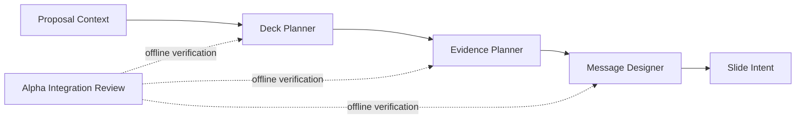

# Presentation Engine 2.0 Architecture Guide

This directory freezes the current Presentation Engine 2.0 design and gives future developers a single architecture guide for Phase 3 and later implementation.

## Design Freeze Scope

The following offline foundation is treated as the current formal architecture:

## Current Status

- Deck Planner: implemented as offline planning layer.
- Evidence Planner: implemented as offline evidence requirement layer.
- Message Designer: implemented as offline message layer.
- Slide Intent: implemented as offline message-to-visual bridge.
- Alpha Integration: implemented as offline integration review for upstream modules.

## Not Frozen as Implemented

The following are not implemented in the production pipeline yet:

- Visual Director
- Blueprint Composer
- Renderer
- PowerPoint rendering through Presentation Engine 2.0
- Version81 runtime integration

## Documents

- `ARCHITECTURE_OVERVIEW.md`
- `SYSTEM_PIPELINE.md`
- `RESPONSIBILITY_MATRIX.md`
- `MODULE_DEPENDENCY.md`
- `DATA_FLOW.md`
- `CONTRACT_GUIDE.md`
- `BOUNDARY_GUIDE.md`
- `EXTENSION_GUIDE.md`
- `IMPLEMENTATION_ORDER.md`
- `DESIGN_DECISIONS.md`
- `KNOWN_LIMITATIONS.md`
- `VERSION81_MIGRATION_PLAN.md`
- `PHASE3_IMPLEMENTATION_GUIDE.md`
- `ROADMAP.md`

## Rule

Future implementation must extend this architecture without changing existing contracts unless a new versioned contract is introduced.
