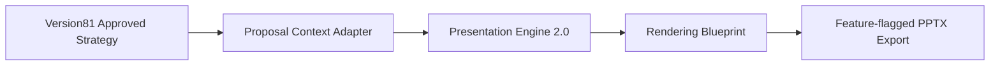

# Version81 Migration Plan

## Current State

Version81 and Presentation Engine 2.0 are not connected.

## Future Integration Point

The safest future connection point is after Proposal Strategy Workspace approval and before PPT generation.

## Contracts Not To Change

- Deck Blueprint
- Evidence Planner Output
- Message Designer Output
- Slide Intent Output

If Version81 needs different fields, add adapters.

## Migration Steps

1. Keep existing PPT generation as default.
2. Add Presentation Engine 2.0 feature flag.
3. Convert Version81 approved strategy into Proposal Context.
4. Run offline pipeline in preview mode.
5. Compare output against existing PPT generation.
6. Add human approval gate.
7. Enable limited UAT.
8. Keep rollback to legacy PPT path.

## Risks

- content drift from existing proposal generator
- missing evidence handling in customer-facing decks
- visual quality lower than current manual expectation
- performance cost after future AI components are added

## Rollback Principle

Feature flag off must restore the existing Version81 flow without data migration.
