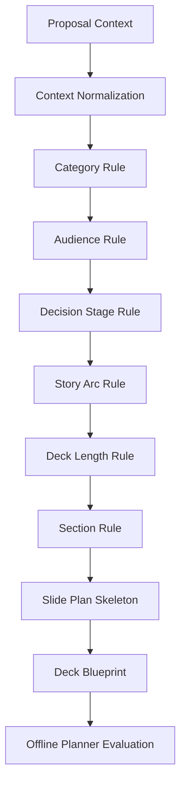

# Planner Architecture

## Purpose

The Deck Planner decides what kind of proposal deck should be created before any slide-level design starts.

## Pipeline

## Boundary

The planner creates section and slide-plan skeletons only. Slide Blueprint generation is reserved for later phases.

## Determinism

The same Proposal Context produces the same deck ID, section order, slide order, and golden output.

