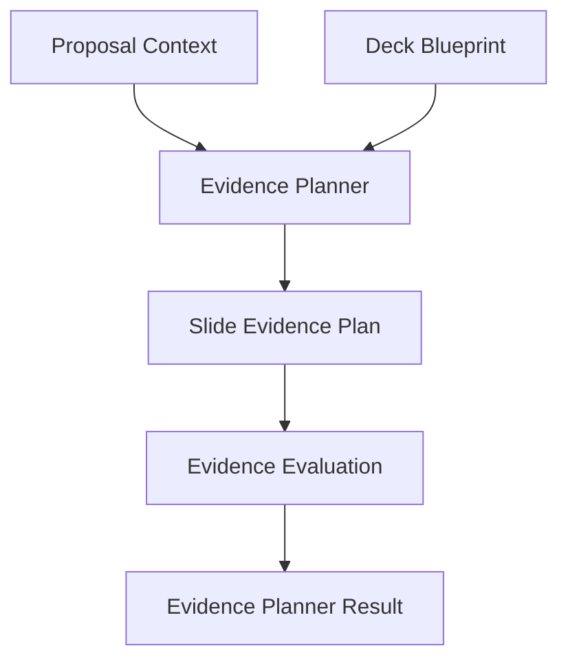

# Evidence Planner Architecture

## Purpose

The Evidence Planner decides what proof is required before a slide can be written or designed.

## Pipeline

## Boundary

The planner creates evidence requirements only. It does not create final copy, diagrams, layouts, Slide Blueprints, or PowerPoint output.

## Output Granularity

One `SlideEvidencePlan` is created for each Deck Blueprint `slide_plan` item.

