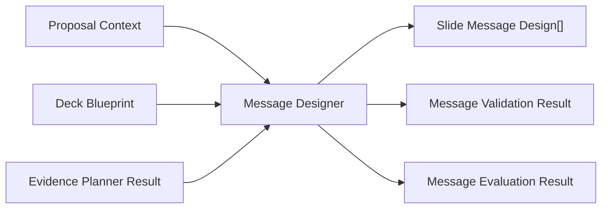

# Message Designer Architecture

## Responsibilities

The Message Designer creates message-level decisions only. It interprets each Deck Blueprint `slide_plan` item and its matching Evidence Planner `slide_evidence` item.

## Processing Steps

1. Validate Proposal Context, Deck Blueprint, and Evidence Planner output.
2. Ensure deck and evidence slide references match exactly.
3. Select message style, tone, purpose, strength, and confidence.
4. Create headline, main message, support points, key takeaway, and speaker note summary.
5. Preserve evidence IDs and disclose missing evidence.
6. Validate and score each slide message.
7. Score the full output.

