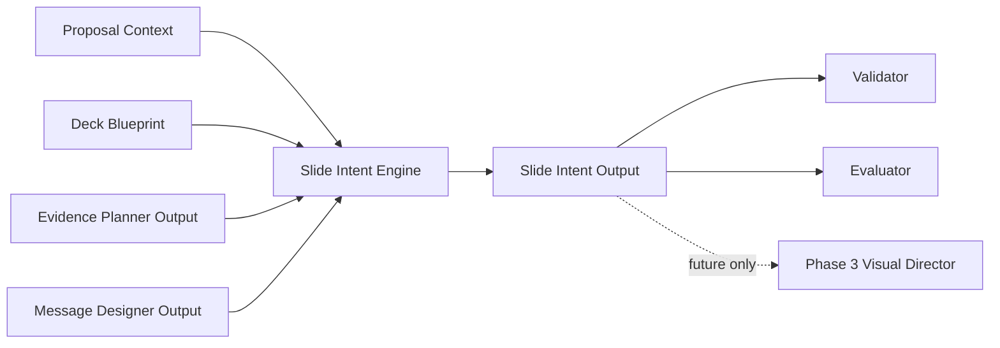

# Slide Intent Architecture

## Responsibility

Slide Intent decides what the viewer should understand from each slide and what abstract visual direction can support that message.

## Boundary

The engine emits abstract candidates only. It does not decide coordinates, shape geometry, fonts, colors, theme tokens, diagrams, charts, or PowerPoint elements.
