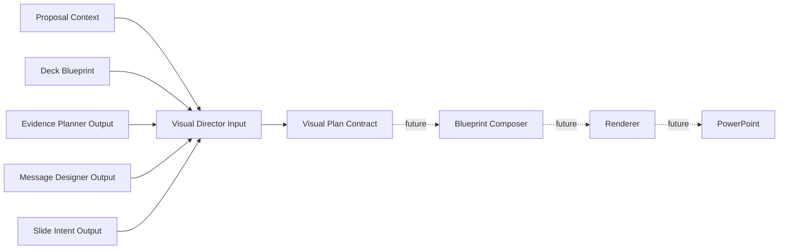

# Presentation Engine 2.0 Phase 3 Preparation

This package freezes the Visual Plan Contract before implementing Visual Director.

Phase 3 preparation defines input, output, schema, validator, enum, and rule
boundaries only. It intentionally does not implement Visual Director, Blueprint
Composer, Renderer, PowerPoint generation, API, database, frontend, OpenAI, or
Beautiful.ai integration.

## Created Contract Area

- `backend/app/presentation_engine_v2/visual_plan_contract/models.py`
- `backend/app/presentation_engine_v2/visual_plan_contract/enums.py`
- `backend/app/presentation_engine_v2/visual_plan_contract/contracts.py`
- `backend/app/presentation_engine_v2/visual_plan_contract/validators.py`
- `backend/app/presentation_engine_v2/visual_plan_contract/schema.py`
- `backend/app/presentation_engine_v2/visual_plan_contract/rules.py`

## Contract Position

## Freeze Rule

Visual Director may generate a Visual Plan Contract in a future phase. It must
not bypass Slide Intent or generate renderer-ready objects directly.
