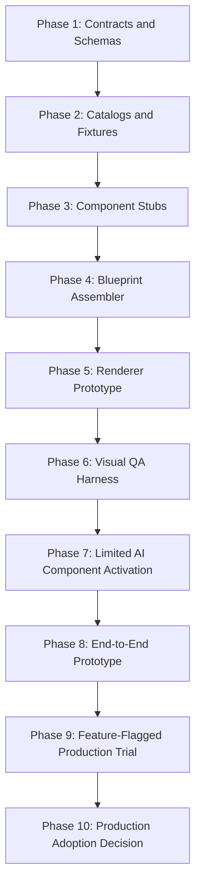

# Implementation Order

This document defines the lowest-risk implementation order for Presentation Engine 2.0.

---

## 1. Dependency Overview

---

## 2. Phase 1: Contracts and Schemas

### Purpose

Make the architecture testable before any rendering or AI integration.

### Work

- implement JSON Schema for blueprint
- define component input/output schemas
- create validator utilities
- add schema fixtures

### Depends on

- this review package

### Tests

- valid blueprint passes
- invalid blueprint fails
- invalid enum fails
- missing renderer fields fail

### Done when

- all contracts validate deterministically
- no production flow calls the new engine

---

## 3. Phase 2: Catalogs and Fixtures

### Purpose

Constrain AI decisions to known slide and diagram types.

### Work

- implement slide catalog
- implement diagram catalog
- implement theme catalog
- create fixture decks for core sales scenarios

### Depends on

- Phase 1 schemas

### Tests

- catalog IDs are unique
- all required core slide types exist
- every visual type maps to supported diagram or layout fallback

### Done when

- fixture decks can be converted into blueprint skeletons

---

## 4. Phase 3: Component Stubs

### Purpose

Build deterministic, non-LLM versions of each component for testability.

### Work

- Slide Intent stub
- Message Designer stub
- White Space Optimizer stub
- Visual Director stub
- Diagram Composer stub
- Hierarchy stub
- Theme stub
- Typography stub

### Depends on

- Phase 2 catalogs

### Tests

- every stub returns only owned fields
- stubs produce valid component output

### Done when

- all component outputs can be assembled into a valid blueprint without AI calls

---

## 5. Phase 4: Blueprint Assembler

### Purpose

Combine component outputs into renderer-ready blueprint JSON.

### Work

- merge component outputs
- validate required fields
- attach warnings and review metadata
- preserve numeric tokens and evidence references

### Depends on

- Phase 3 component outputs

### Tests

- missing component output creates structured warning or error
- numeric tokens are preserved
- assembled blueprint validates

### Done when

- fixture inputs generate complete blueprints

---

## 6. Phase 5: Renderer Prototype

### Purpose

Render a small supported subset into editable PowerPoint.

### Scope

Only support:

- Cover
- Executive Summary
- Problem
- Before/After
- Architecture
- Timeline
- KPI
- Estimate
- Next Action

### Depends on

- Phase 4 blueprints

### Tests

- PPTX opens without repair
- no broken relationships
- all text editable
- no body text below 17 pt
- page numbers are correct

### Done when

- supported fixture decks render visually acceptable PPTX outputs

---

## 7. Phase 6: Visual QA Harness

### Purpose

Make quality measurable.

### Work

- render PPTX pages to PNG
- create contact sheets
- inspect text overflow
- inspect broken relationships
- inspect font floors
- run visual rubric scoring

### Depends on

- Phase 5 renderer

### Tests

- deliberately broken fixture fails
- valid fixture passes

### Done when

- human reviewers can compare outputs consistently

---

## 8. Phase 7: Limited AI Component Activation

### Purpose

Replace deterministic stubs with AI one component at a time.

### Suggested order

1. Slide Intent AI
2. Message Designer AI
3. Visual Director AI
4. White Space Optimizer
5. Diagram Composer
6. Hierarchy Engine
7. Theme Engine
8. Typography Engine

### Depends on

- Phase 6 QA harness

### Tests

- each AI output validates
- failure recovery returns safe JSON
- no component outputs fields it does not own

### Done when

- AI-generated blueprints pass QA for fixtures

---

## 9. Phase 8: End-to-End Prototype

### Purpose

Run real sample proposals through the full non-production pipeline.

### Work

- build prototype CLI or isolated internal tool
- run 10 to 20 proposal scenarios
- collect rendered decks and review reports

### Depends on

- Phase 7 AI outputs

### Tests

- scenario coverage
- visual QA
- human review

### Done when

- average human visual score is at least 4 out of 5

---

## 10. Phase 9: Feature-Flagged Production Trial

### Purpose

Expose engine to limited users without replacing existing generation.

### Work

- add feature flag
- keep legacy generator default
- provide side-by-side output comparison
- collect reviewer feedback

### Depends on

- Phase 8 acceptance

### Tests

- feature flag off uses legacy
- feature flag on uses PE2 path
- legacy tests remain unchanged

### Done when

- no legacy regression
- trial users approve quality

---

## 11. Phase 10: Production Adoption Decision

### Purpose

Decide whether to adopt, refine, or rollback.

### Criteria

- no critical defects
- visual score target met
- proposal accuracy verified
- renderer stability verified
- user editing needs met
- rollback plan confirmed

### Done when

- human approval is recorded
- adoption scope is explicitly defined

---

## 12. Implementation Gate Summary

| Gate | Required before proceeding |
|---|---|
| Contract gate | schemas and component contracts pass |
| Catalog gate | IDs and required mappings pass |
| Renderer gate | editable PPTX and no repair |
| Visual gate | PNG QA and human review |
| AI gate | output JSON and failure recovery pass |
| Production gate | feature flag and legacy regression pass |
