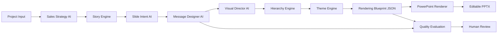

# Architecture

Presentation Engine 2.0 is placed after Sales Strategy AI and Story Engine, and before the PowerPoint Renderer.

---

## Architecture Overview



---

## Design Principle

The renderer must not decide strategy, story, or message. It only renders an already designed blueprint.

The message design process must happen before visual rendering.

---

## Layer Responsibilities

| Layer | Responsibility | Output |
|---|---|---|
| Strategy Layer | Decides who to persuade and why | Sales Strategy Brief |
| Story Layer | Decides the overall proposal sequence | Story Outline |
| Intent Layer | Decides each slide's job | Slide Intent Map |
| Message Layer | Designs main point and supporting evidence | Message Plan |
| Visual Layer | Chooses visual expression | Visual Plan |
| Hierarchy Layer | Defines scale, spacing, priority, gaze path | Hierarchy Plan |
| Theme Layer | Applies design language | Theme Token Set |
| Blueprint Layer | Serializes everything for renderer | Rendering Blueprint JSON |
| Renderer Layer | Produces editable PowerPoint shapes | PPTX |

---

## Version81 Comparison

### Missing in Version81

- Slide-level intent before layout choice
- Explicit message deletion and emphasis decisions
- Consulting-grade visual direction
- Diagram-specific planning
- Typography and white space as first-class engines
- Rendering blueprint contract independent from PowerPoint

### Reusable from Version81

- Proposal Strategy Workspace
- Sales Strategy Brief
- Presentation Quality Engine findings
- Layout Library IDs as compatibility hints
- Numeric Integrity and post-render validation
- Existing PPTX renderer safety checks

### Should Be Discarded or Downgraded

- Treating layout selection as the primary design decision
- Reusing the same card layout for many different slide goals
- Passing dense content directly to rendering
- Letting renderer infer missing strategy

---

## Integration Boundary

Presentation Engine 2.0 should expose a single output contract:

```text
RenderingBlueprint
```

PowerPoint Renderer receives only the blueprint. It must not re-run:

- Sales Strategy
- Story selection
- Slide intent classification
- Message prioritization
- Theme selection

