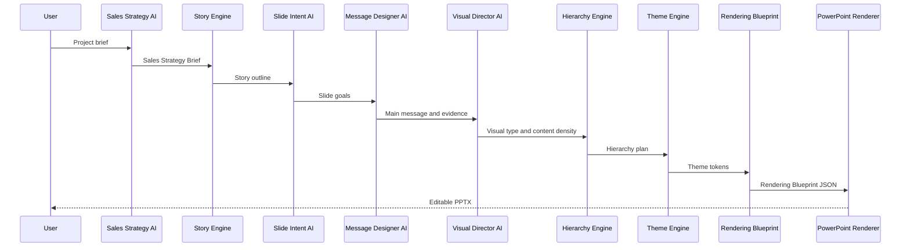

# Pipeline

Presentation Engine 2.0 introduces a message-first pipeline.

---

## Full Flow

---

## Step Details

| Step | Input | Output | Key Decision |
|---|---|---|---|
| Sales Strategy AI | Project brief | Sales Strategy Brief | Who to persuade and why |
| Story Engine | Strategy Brief | Story Outline | Proposal sequence |
| Slide Intent AI | Story Outline | Slide Intent Map | Purpose of each slide |
| Message Designer AI | Intent Map | Message Plan | What to say, cut, emphasize |
| Visual Director AI | Message Plan | Visual Plan | Best visual form |
| Hierarchy Engine | Visual Plan | Hierarchy Plan | What the eye sees first |
| Theme Engine | Strategy, Audience, Hierarchy | Theme Tokens | Design language |
| Rendering Blueprint | All plans | Blueprint JSON | Renderer contract |
| PowerPoint Renderer | Blueprint JSON | PPTX | Editable rendering |

---

## Failure Handling

| Failure | Behavior |
|---|---|
| Missing evidence | Mark as confirmation item |
| Too much content | White Space Optimizer splits or compresses |
| No clear visual | Use message-first minimal layout |
| Unsupported diagram | Use safe editable fallback |
| Risk of numeric change | Stop and require review |
| Low confidence | Human review required |

---

## Human Review Gate

Human review should happen before rendering when:

- Main message is inferred from weak evidence.
- ROI, schedule, price, or success rate is not provided.
- Diagram contains assumptions.
- Slide has legal, financial, security, or executive approval implications.
- Confidence is below the configured threshold.

