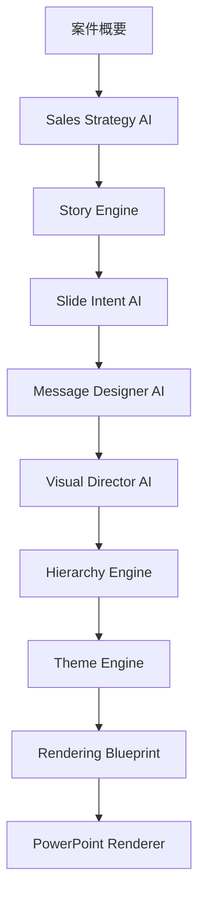

# Presentation Engine 2.0

Status: Design only
Decision: Presentation Engine 2.0 Ready

---

## Purpose

Presentation Engine 2.0 is a new design initiative for Ready Crew Proposal AI / ProposalPilot.

The goal is not to merely generate PowerPoint files. The goal is to reproduce, through AI, the quality of proposal decks created by top sales representatives and consultants.

Version81 focused on placing information into layouts. Presentation Engine 2.0 focuses on designing the message itself.

---

## Core Idea

Presentation Engine 2.0 changes the generation unit from "slide content plus layout" to "slide intent plus designed message plus rendering blueprint".

Every slide must answer:

1. Why does this slide exist?
2. What should the audience remember?
3. What should be removed?
4. What should be emphasized?
5. What visual form best communicates the point?
6. How should hierarchy, typography, color, spacing, and diagram structure guide the reader?

---

## Components

| Component | Responsibility |
|---|---|
| Slide Intent AI | Determines the purpose of each slide |
| Message Designer AI | Designs the main message and cuts unnecessary content |
| Visual Director AI | Chooses the best visual expression |
| Hierarchy Engine | Designs information hierarchy, spacing, and gaze flow |
| Theme Engine | Selects design theme and visual language |
| Diagram Composer | Designs editable diagrams instead of SmartArt-like output |
| Typography Engine | Defines type hierarchy for titles, body, numbers, notes |
| White Space Optimizer | Adjusts density, splitting, and card structure |
| Rendering Blueprint | Defines the JSON contract before PowerPoint rendering |
| PowerPoint Renderer | Converts Blueprint into editable PowerPoint shapes |

---

## New Pipeline

---

## Version81 Comparison

| Area | Version81 | Presentation Engine 2.0 |
|---|---|---|
| Main philosophy | Put information into layout | Design the message |
| Slide unit | Slide type and layout decision | Slide goal, message, evidence, hierarchy, blueprint |
| Quality control | Rule-based checks after content exists | Intent and hierarchy designed before rendering |
| Layout | Selected from layout library | Generated as message-specific visual plan |
| Diagram | Layout hint and renderer pattern | Dedicated Diagram Composer |
| Theme | Template-level selection | Audience and proposal strategy aware theme system |
| Human value | Improves proposal workflow | Raises strategic and consulting quality |

---

## What to Reuse from Version81

- Sales Strategy AI
- Story Engine
- Presentation Quality Engine rules
- Designer AI layout vocabulary
- PPTX quality report concept
- Numeric Integrity checks
- Human Review mindset
- Existing export and renderer safety principles

## What to Replace or De-emphasize

- Fixed layout-first thinking
- SmartArt-like generic diagrams
- Repeated KPI card layouts
- Slide type classification that ignores slide intent
- Visual decisions made after content is already dense
- Quality scoring that does not detect message weakness

## What Not to Build in This Phase

- Frontend implementation
- Backend API
- Database schema
- Migration
- PowerPoint renderer changes
- New AI runtime calls
- Deployment
- Git commit / push

This directory is the design basis only.
