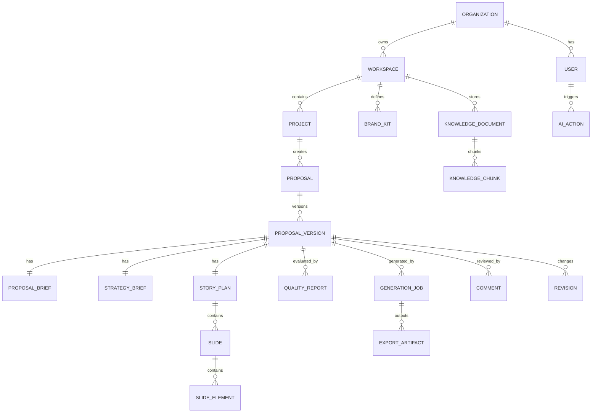

# Data Model Design

## Current Entities

`backend/app/database/schema.py`にはOrganization、Workspace、User、Customer、Project、Proposal History、Business Improvement、Proposal Agent Memory、Usage/Audit Logs、Knowledge、Templates、Quality Gates、Beautiful.ai Presentations、Presentation Review、Proposal Optimizationなどが存在する。

## Future Entities

## Entity Notes

| Entity | Purpose | Workspace Boundary | PII/Secret |
|---|---|---|---|
| Proposal | Projectから作る提案単位 | required | 顧客情報あり |
| ProposalVersion | 編集履歴 | required | 顧客情報あり |
| ProposalBrief | Prompt Builder入力 | required | 顧客情報あり |
| StrategyBrief | Strategy出力 | required | 秘密値なし |
| StoryPlan | スライド構成 | required | 顧客情報あり |
| Slide / SlideElement | Studio編集 | required | 顧客情報あり |
| DesignTheme | テンプレート | optional shared | 秘密なし |
| BrandKit | 会社ブランド | required | ロゴ、会社情報 |
| GenerationJob | 長時間処理 | required | 入力全文保存は最小化 |
| ExportArtifact | PPTX/PDF/Beautiful.ai | required | URLは権限確認必須 |
| QualityReport | 品質結果 | required | 入力抜粋は最小化 |
| AIAction | AI操作ログ | required | prompt全文保存禁止 |
| KnowledgeDocument | ナレッジ | required | 機密情報あり得る |
| ProposalMetric | 時間/品質測定 | required | 個人識別に注意 |

## Indexes

- `(organization_id, workspace_id, project_id)`
- `(workspace_id, proposal_id, version_number)`
- `(workspace_id, created_by, created_at)`
- `(workspace_id, status, updated_at)`
- `(workspace_id, artifact_type, created_at)`

## Soft Delete

Proposal、Project、KnowledgeDocument、BrandKitはSoft Deleteを基本とする。Audit Logは削除せず保持期間で管理する。

