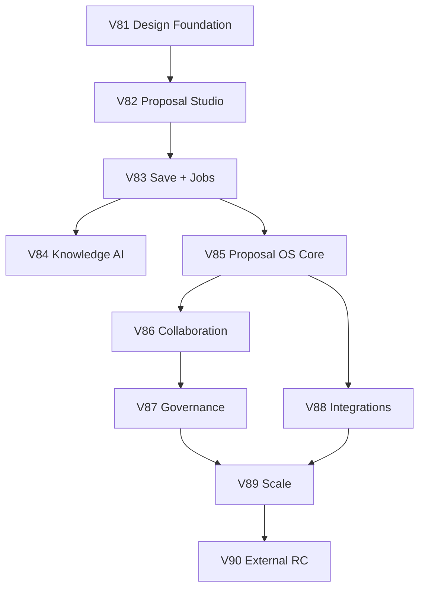

# Dependency Map

## Critical Dependencies

- Proposal Studio requires ProposalVersion and SlidePlan.
- Job progress requires GenerationJob.
- Knowledge AI requires strict Workspace/Organization scoping.
- Collaboration requires object-level permissions.
- External RC requires observability and rollback.

