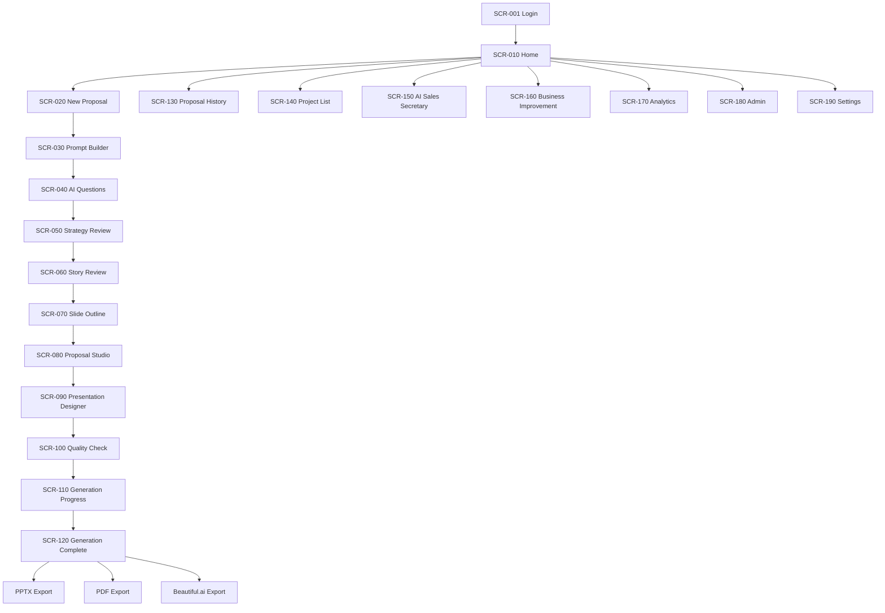

# Navigation Map

## Breadcrumb Examples

- Home / New Proposal / Prompt Builder / Confirm
- Home / Proposal History / Proposal Detail / Studio
- Home / Admin / Users
- Home / Settings / Workspace

## Current Implementation Mapping

| Future Node | Current Implementation |
|---|---|
| Home | `experienceView="home"` in AppShell |
| New Proposal | `experienceView="new-proposal"` + GuidedFlow + ProposalExperienceStudio |
| Proposal Studio | `experienceView="editor"` + ProposalExperienceStudio |
| Templates | `experienceView="templates"` + ProposalExperienceStudio Designer |
| History | CreationHistoryPanel |
| Admin | AdminSection and Admin panels |
| Settings | WorkspaceSwitcher, SystemDiagnosticsPanel |

