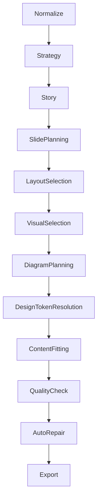

# Presentation AI Engine Overview

Presentation AI Engineは、営業提案をPowerPointとしてどう見せるかを決める層である。Strategy EngineやStory Engineが「何を伝えるか」を決め、Presentation AI Engineは「どのスライドで、どの構図で、どの視覚表現にするか」を決める。

## Modules

1. Story AI
2. Slide Intelligence
3. Layout AI
4. Visual AI
5. Diagram AI
6. Color AI
7. Icon AI
8. Designer AI
9. Quality AI
10. Export AI

## Processing Order

## Current Status

Version80ではPresentation Designer UI、PPTテンプレート選択、PPTX requestへの`design_template`送信、Backend theme解決が部分実装済み。Presentation AI Engineとしての統合処理は未実装。

