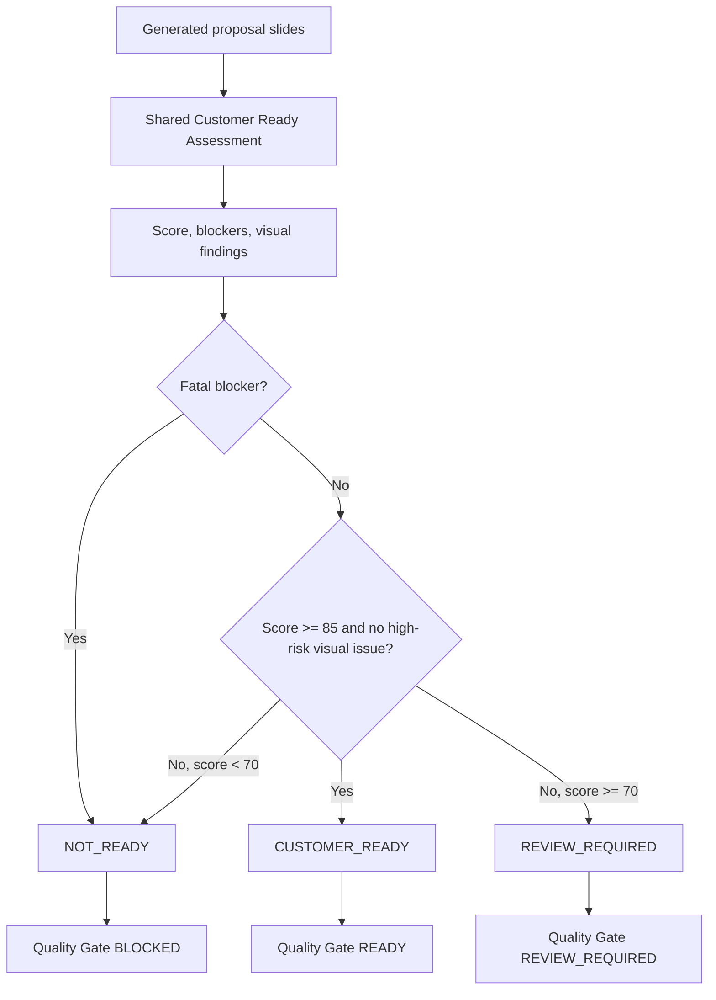

# Version 2.2 Final Release Status

Generated: 2026-07-30 07:59:48 JST

## Current Official Release Decision

**REVIEW_REQUIRED_BEFORE_RELEASE**

Version 2.2 has cleared the rendering blocker, full Backend/Frontend/E2E tests pass, and Quality Gate / Proposal Validation judgement is unified. However, the 20 real-project artifacts remain `REVIEW_REQUIRED` with explicit customer-facing fixes or confirmations. The release package should not be labeled `READY_FOR_RELEASE` until either those fixes are completed or the release policy explicitly accepts a review-required pilot release.

## Audit History

| Timepoint | Document | Decision | Meaning |
|---|---|---|---|
| Initial Version 2.2 certification | `artifacts/customer_ready_v22/customer_ready_summary.md` | `CERTIFIED_CUSTOMER_READY` | Historical report; later found to be too broad because it only blocked `NOT_READY`. |
| RC audit | `docs/release/v2.2-rc-fix/RC_FIX_REPORT.md` | `CERTIFIED_CUSTOMER_READY` | Historical report; kept unchanged except for latest-status notice. |
| Independent/LibreOffice audit | `docs/release/v2.2-rc-fix/LIBREOFFICE_RENDER_AUDIT.md` | `REVIEW_REQUIRED BEFORE FINAL RELEASE` | Real rendering blocker resolved; Git/report consistency and REVIEW_REQUIRED analysis remained. |
| Final reconciliation | this file | `REVIEW_REQUIRED_BEFORE_RELEASE` | Current official status. |

## Why The Decision Changed

The release evidence previously mixed product-quality certification with absence of fatal blockers. In the current reconciliation, `CUSTOMER_READY` means the generated material itself is ready for customer submission quality, while normal final sales review is still expected. `REVIEW_REQUIRED` means explicit fixes or customer confirmations remain. Because all 20 real cases have explicit fixes, the official release decision is not promoted to `READY_FOR_RELEASE`.

## Unified Judgement Criteria

### CUSTOMER_READY

Material quality is suitable for customer submission. Normal final sales review is still expected, but no explicit content/visual fix is required by the automated gate.

### REVIEW_REQUIRED

The material generated successfully, but explicit fixes or customer confirmations are required before submission. Examples: competitor assumptions, KPI targets, estimate assumptions, risk explanation, or long text compression.

### NOT_READY

The proposal has a release-blocking issue such as missing customer identity, contradictory pricing, internal notes, unsupported claims, clipping/overlap, page loss, or major schedule contradiction.

## LibreOffice Real Rendering Result

| Check | Result |
|---|---:|
| PDF conversion | 20 / 20 |
| PNG rendering | 20 / 20 |
| Page count match | 20 / 20 |
| Visual QA P0 | 0 |
| Visual QA P1 | 0 |
| Visual QA P2 | 6 |

The remaining P2 findings are `edge_content` warnings caused by intended full-bleed cover background design. They are classified as `accepted_design` / `false_positive` only for full-slide background artwork. Text, cards, and body content edge contact remains detectable.

Evidence root: `artifacts/customer_ready_v22/libreoffice_real_render_20260730_071018`

## Git State

See `docs/release/v2.2-final/GIT_AUDIT.md`.

- Modified tracked files: 28
- Untracked files after ignore audit: 61
- Deleted tracked files: 0
- Next git add target list: documented in `GIT_AUDIT.md`
- `git add`, commit, push, deploy: not executed

## Backend Test Result

- Full pytest: PASS, 518 tests collected and executed with `--basetemp=.pytest-tmp-v22-final-reconciliation`.
- Initial default run failed only because the existing fixed `.pytest-tmp` directory could not be deleted on Windows; rerun with isolated basetemp passed.
- compileall: PASS
- pip check: PASS

## Frontend Test Result

- typecheck: PASS
- check:unused: PASS
- build: PASS
- Full Playwright E2E: PASS, 75 passed

## Quality Revalidation

| Check | Result |
|---|---:|
| Real project cases | 20 |
| 20-case revalidation script | PASS, certification = `REVIEW_REQUIRED_BEFORE_RELEASE` |
| Customer Ready Gate `READY` | 0 |
| Customer Ready Gate `REVIEW_REQUIRED` | 20 |
| Customer Ready Gate `BLOCKED/ERROR` | 0 |
| Proposal Validation `CUSTOMER_READY` | 0 |
| Proposal Validation `REVIEW_REQUIRED` | 20 |
| Proposal Validation `NOT_READY` | 0 |
| Average total score | 71.3 |
| Gate / Validation consistency | 20 / 20 |

Detailed case analysis: `docs/release/v2.2-final/REAL_PROJECT_REVIEW_REQUIRED_ANALYSIS.md`

## Why All 20 Cases Are REVIEW_REQUIRED

The common causes are:

1. Executive Summary needs stronger background, issue, conclusion, and expected-value compression.
2. Story flow should more clearly connect current state, issue, cause, solution, implementation, effect, and next action.
3. ROI/KPI needs measurement method, timing, owner, and assumptions.
4. Competitor assumptions, winning strategy, differentiation, and confirmation items need separation.
5. Long titles and bullet-heavy pages need one-message-per-slide compression.
6. Implementation, operation, security, and mitigation risks need clearer treatment.

This is not classified as a threshold bug. The score range is 71-72, and the fixes are concrete.

## Judgement Criteria Change

- Scoring thresholds: unchanged.
- Customer Ready Gate model: unchanged.
- Proposal Validation model: unchanged.
- Release certification wording in `scripts/customer_ready_v22_certification.py`: corrected so cases with `REVIEW_REQUIRED` are reported as `REVIEW_REQUIRED_BEFORE_RELEASE`, not `CERTIFIED_CUSTOMER_READY`.

## Old/New 20-Case Rejudgement

| Case | Old | New | Score Change | Reason |
|---|---|---|---:|---|
| case_01 | REVIEW_REQUIRED | REVIEW_REQUIRED | 0 | ????????????????????????????????REVIEW_REQUIRED? |
| case_02 | REVIEW_REQUIRED | REVIEW_REQUIRED | 0 | ????????????????????????????????REVIEW_REQUIRED? |
| case_03 | REVIEW_REQUIRED | REVIEW_REQUIRED | 0 | ????????????????????????????????REVIEW_REQUIRED? |
| case_04 | REVIEW_REQUIRED | REVIEW_REQUIRED | 0 | ????????????????????????????????REVIEW_REQUIRED? |
| case_05 | REVIEW_REQUIRED | REVIEW_REQUIRED | 0 | ????????????????????????????????REVIEW_REQUIRED? |
| case_06 | REVIEW_REQUIRED | REVIEW_REQUIRED | 0 | ????????????????????????????????REVIEW_REQUIRED? |
| case_07 | REVIEW_REQUIRED | REVIEW_REQUIRED | 0 | ????????????????????????????????REVIEW_REQUIRED? |
| case_08 | REVIEW_REQUIRED | REVIEW_REQUIRED | 0 | ????????????????????????????????REVIEW_REQUIRED? |
| case_09 | REVIEW_REQUIRED | REVIEW_REQUIRED | 0 | ????????????????????????????????REVIEW_REQUIRED? |
| case_10 | REVIEW_REQUIRED | REVIEW_REQUIRED | 0 | ????????????????????????????????REVIEW_REQUIRED? |
| case_11 | REVIEW_REQUIRED | REVIEW_REQUIRED | 0 | ????????????????????????????????REVIEW_REQUIRED? |
| case_12 | REVIEW_REQUIRED | REVIEW_REQUIRED | 0 | ????????????????????????????????REVIEW_REQUIRED? |
| case_13 | REVIEW_REQUIRED | REVIEW_REQUIRED | 0 | ????????????????????????????????REVIEW_REQUIRED? |
| case_14 | REVIEW_REQUIRED | REVIEW_REQUIRED | 0 | ????????????????????????????????REVIEW_REQUIRED? |
| case_15 | REVIEW_REQUIRED | REVIEW_REQUIRED | 0 | ????????????????????????????????REVIEW_REQUIRED? |
| case_16 | REVIEW_REQUIRED | REVIEW_REQUIRED | 0 | ????????????????????????????????REVIEW_REQUIRED? |
| case_17 | REVIEW_REQUIRED | REVIEW_REQUIRED | 0 | ????????????????????????????????REVIEW_REQUIRED? |
| case_18 | REVIEW_REQUIRED | REVIEW_REQUIRED | 0 | ????????????????????????????????REVIEW_REQUIRED? |
| case_19 | REVIEW_REQUIRED | REVIEW_REQUIRED | 0 | ????????????????????????????????REVIEW_REQUIRED? |
| case_20 | REVIEW_REQUIRED | REVIEW_REQUIRED | 0 | ????????????????????????????????REVIEW_REQUIRED? |

## Secret Audit

PASS for release code and evidence scope. Test dummy secrets and local validation venv/package strings were excluded from final secret-scan scope; no production API key, private key, bearer token, or password-bearing DB URL was found in release code/evidence.

## Unresolved Issues

| Priority | Item | Status |
|---|---|---|
| High | 20 real cases require explicit fixes/confirmations before customer submission | Open |
| Medium | Release-required source/test/docs are still untracked until a human performs the explicit git add list | Open by policy; no git add performed |
| Low | Historical reports contain older decisions | Mitigated by top notice and this official final status |

## Current Release Decision Rationale

`REVIEW_REQUIRED_BEFORE_RELEASE` is the honest current decision because:

- Backend pytest, compileall, pip check passed.
- Frontend typecheck, unused check, build, and 75 Playwright E2E tests passed.
- LibreOffice rendering is verified: 20/20 PDF and PNG success.
- There are no P0/P1 visual blockers.
- Gate and Validation agree on all 20 real cases.
- The all-REVIEW_REQUIRED result is explainable and not a code mismatch.
- The release documentation is centralized in this file.
- The real cases still have explicit pre-submission fixes and confirmations.

## Required Next Step To Reach READY_FOR_RELEASE

1. Complete the explicit fixes/confirmations for the 20 real cases, or define the release as a pilot that allows `REVIEW_REQUIRED` artifacts.
2. Review `GIT_AUDIT.md`, then explicitly add only the listed release files. Do not use `git add .`.
3. Confirm final human sales review policy: `CUSTOMER_READY` may still require normal final sales review, while `REVIEW_REQUIRED` requires concrete fixes/confirmation before submission.
