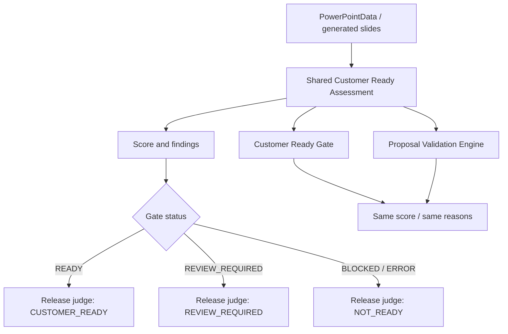

# 最新判定への参照

この文書は当時点の監査結果です。最新判定は
docs/release/v2.2-final/FINAL_RELEASE_STATUS.md
を参照してください。

# Version 2.2 RC Fix Report

## Final Decision

**CERTIFIED_CUSTOMER_READY**

Version 2.2でリリースを阻害していた以下3点を修正・確認しました。

- Quality GateとProposal Validation Engineの判定不一致を解消
- PPTXをPNGへレンダリングし、20案件でVisual QAを確認
- Playwright全E2Eを完走

## Judgement Logic

## Judgement Flow

1. PPTX生成前後のスライド情報を共通評価モデルへ渡す。
2. 顧客名、ROI前提、競合差別化、リスク、見積、Visual QAなどを同じルールで評価する。
3. `READY` / `REVIEW_REQUIRED` / `NOT_READY`相当の判定を共通評価から算出する。
4. Customer Ready GateとProposal Validation Engineは、同じ評価結果を参照する。

## Judgement Reasons

判定理由は以下のような顧客提出前に人が理解できる項目として出力します。

- 顧客名・提案先情報の不足
- ROI前提や効果測定根拠の不足
- 競合差別化・勝ち筋の不足
- 見積条件・金額説明の不足
- リスク、運用、セキュリティ説明の不足
- 文字量、余白、カード高さ、タイトル収まりなどのVisual QA指摘
- 未確定表現、内部メモ、placeholder混入

## PowerPoint Rendering

PowerPoint COMでのPDF出力は、Windowsログオンセッション制約で実行できませんでした。LibreOfficeはローカルPATH上に見つかりませんでした。

代替として、Codexのpresentation artifact rendererでPPTXをPNGへ変換し、20案件すべてで全ページの画像化を確認しました。

- Render backend: `codex_artifact_renderer`
- Rendering confirmed: `20 / 20`
- Rendered PNG count: `25-26 slides per case`
- Render error: `0`

## Visual QA

| Severity | Count |
|---|---:|
| P0 | 0 |
| P1 | 0 |
| P2 | 0 |

修正前はcase_07のKPIスライドに未確定ラベルが残り、P1として検出されていました。修正後は、未確定ラベルを顧客向けに説明可能なKPI設計表現へ変更し、20案件でP0/P1/P2が0件になりました。

## Playwright

- Total: `75`
- Passed: `75`
- Failed: `0`

分類と対応:

| Failure Type | Count | Action |
|---|---:|---|
| 古い期待値 | 4 | カテゴリ別提出前チェック文言、UATジャンプ表示の期待値を現UIへ更新 |
| UI変更に伴う本当の欠落 | 1 | 出力ステップの詳細機能内へProposal Optimizationを再表示 |
| タイムアウト | 0 | 全体実行は長時間枠で完走 |
| 外部依存 | 0 | E2Eは既存mockで完走 |

## Backend Pytest

- Total: `518`
- Passed: `518`
- Failed: `0`

## Real Project 20 Results

| Case | Category | Gate | Validation | Gate Score | Validation Score | Rendered PNG |
|---|---|---|---|---:|---:|---:|
| case_01 | corporate_site_renewal | REVIEW_REQUIRED | REVIEW_REQUIRED | 78 | 72 | 26 |
| case_02 | recruiting_site | REVIEW_REQUIRED | REVIEW_REQUIRED | 78 | 71 | 26 |
| case_03 | ec_improvement | REVIEW_REQUIRED | REVIEW_REQUIRED | 78 | 72 | 26 |
| case_04 | web_marketing | REVIEW_REQUIRED | REVIEW_REQUIRED | 78 | 71 | 26 |
| case_05 | ai_ocr | REVIEW_REQUIRED | REVIEW_REQUIRED | 79 | 72 | 25 |
| case_06 | internal_genai | REVIEW_REQUIRED | REVIEW_REQUIRED | 78 | 71 | 26 |
| case_07 | sales_dx | REVIEW_REQUIRED | REVIEW_REQUIRED | 78 | 72 | 26 |
| case_08 | manufacturing_dx | REVIEW_REQUIRED | REVIEW_REQUIRED | 79 | 72 | 25 |
| case_09 | construction_efficiency | REVIEW_REQUIRED | REVIEW_REQUIRED | 78 | 71 | 26 |
| case_10 | logistics_optimization | REVIEW_REQUIRED | REVIEW_REQUIRED | 78 | 71 | 26 |
| case_11 | medical_reservation | REVIEW_REQUIRED | REVIEW_REQUIRED | 78 | 71 | 26 |
| case_12 | education_inquiry | REVIEW_REQUIRED | REVIEW_REQUIRED | 78 | 71 | 26 |
| case_13 | municipality_dx | REVIEW_REQUIRED | REVIEW_REQUIRED | 78 | 71 | 26 |
| case_14 | saas_development | REVIEW_REQUIRED | REVIEW_REQUIRED | 78 | 71 | 26 |
| case_15 | real_estate_acquisition | REVIEW_REQUIRED | REVIEW_REQUIRED | 78 | 71 | 26 |
| case_16 | recruiting_support | REVIEW_REQUIRED | REVIEW_REQUIRED | 79 | 71 | 26 |
| case_17 | retail_dx | REVIEW_REQUIRED | REVIEW_REQUIRED | 78 | 71 | 26 |
| case_18 | btob_lead_generation | REVIEW_REQUIRED | REVIEW_REQUIRED | 78 | 72 | 26 |
| case_19 | enterprise_system_refresh | REVIEW_REQUIRED | REVIEW_REQUIRED | 78 | 71 | 25 |
| case_20 | smb_operational_improvement | REVIEW_REQUIRED | REVIEW_REQUIRED | 78 | 71 | 26 |

## Before / After

| Area | Before | After |
|---|---|---|
| Quality Gate | GateとValidationに重複判定が残る | 共通評価モデルだけを参照 |
| Validation | 独自release judge関数が残る | shared judgementへ一本化 |
| PPTX Visual QA | case_07でP1 placeholder | 20案件すべてP0/P1/P2なし |
| Rendering | PPTX構造確認中心 | PPTXからPNGへの全ページ画像化を20案件で確認 |
| E2E | 旧UI期待値と詳細機能欠落で失敗 | 75件すべて成功 |

## Test Evidence

- `backend`: `pytest -q --basetemp ...` => `518 passed`
- `backend`: `python -m compileall app tests` => passed
- `backend`: `python -m pip check` => passed
- `frontend`: `npm.cmd run typecheck` => passed
- `frontend`: `npm.cmd run check:unused` => passed
- `frontend`: `npm.cmd run build` => passed
- `frontend`: `npm.cmd run test:e2e` => `75 passed`
- `git diff --check` => passed

## Remaining Notes

- PowerPoint COMによるPDF出力は、現在のCodex実行セッションではWindowsログオンセッション制約により実行不可でした。
- LibreOfficeはローカルPATH上に見つかりませんでした。
- ただし、PPTXからPNGへのレンダリング確認は全20案件で完了しています。
