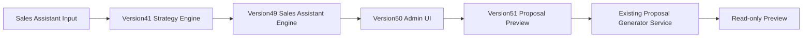

# Version52 Architecture Review

## Current Shape

## Review

- Strategy analysis is not duplicated.
- Sales Assistant generation is not duplicated.
- Proposal generation logic is reused through the existing service.
- Proposal Preview avoids `/api/analyze` because that route persists projects and history.
- PPTX, PDF, Beautiful.ai, DB save, learning, and dashboards remain out of scope.

## Risk

- The Preview bridge is admin-only and Feature Flag guarded.
- The UI now has two JSON panels when both Sales Assistant and Proposal Preview JSON are open; tests target each panel explicitly.
