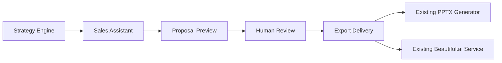

# Version 55 Production Hardening & Maintainability

Version55は、Version41からVersion54で追加したStrategy Engine、Sales Assistant、Proposal Preview、Human Review、Export Deliveryを対象に、保守性と運用性を確認したRelease Candidate向けの整理である。

## 方針

- 新しいAI生成は追加しない。
- Proposal品質、PPTX生成、Beautiful.ai生成は変更しない。
- DB、Migration、外部APIは追加しない。
- Feature Flag既定値は維持する。
- 挙動不変のテストfixture共通化、型補強、ドキュメント更新のみ行う。

## 参照文書

- [Architecture Cleanup](./architecture_cleanup.md)
- [Dependency Review](./dependency_review.md)
- [Logging Review](./logging_review.md)
- [Maintainability](./maintainability.md)
- [Release Assessment](./release_assessment.md)
- [Future Versions](./future_versions.md)

## Version55で確認した境界

Export Deliveryは既存PPTX Generatorと既存Beautiful.ai Serviceを呼び出すだけで、提案生成やデザイン生成の判断を再実装しない。
