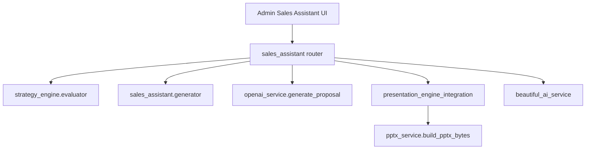

# Architecture Cleanup

## 対象

- Version41 Strategy Engine
- Version49 Sales Assistant Engine
- Version50 Sales Assistant UI
- Version51 Proposal Preview
- Version53 Export Workflow
- Version54 Export Delivery

## 依存関係

## レイヤ確認

| 項目 | 評価 | メモ |
| --- | --- | --- |
| Strategy判定 | OK | `strategy_engine.evaluator`に集約 |
| Sales Assistant生成 | OK | `sales_assistant.generator`に集約 |
| Proposal Preview | OK | 既存`generate_proposal`を再利用 |
| PPTX Export | OK | 既存`build_pptx_bytes_for_engine`を再利用 |
| Beautiful.ai Export | OK | 既存`create_beautiful_ai_presentation`を再利用 |
| DB保存 | OK | Sales Assistant / Preview / Exportでは追加保存なし |

## 循環参照

明確な循環参照は確認していない。`sales_assistant` routerは統合境界として依存が多いため、将来はrequest/response組立、review gate、export deliveryを別moduleへ分ける余地がある。

## レイヤ違反リスク

- RouterがStrategy入力、Proposal Preview入力、Export入力を一括で組み立てている。
- 現時点では小規模な統合境界として許容する。
- Version56以降で`app/sales_assistant/pipeline.py`や`export_delivery.py`へ分割すると読みやすい。
