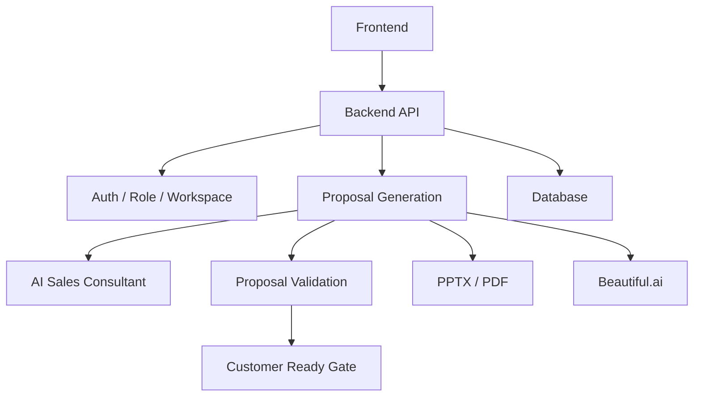

# Version 2.2 Release Notes

## Overview

Ready Crew Proposal AI Version 2.2 is the production release preparation candidate for the AI Sales Secretary web service. The release focuses on customer-ready proposal quality, operational readiness, and deployment documentation.

This preparation step does not add new AI features, new analysis engines, new PPTX functionality, or new UI. It documents the current product state so the project can move from development to production operation.

## Release Date

2026-07-30

## Version 2.2 Additions

- AI Sales Consultant Engine for internal proposal strategy thinking.
- Proposal Validation Engine for multi-perspective review.
- Customer Ready Gate with unified READY / REVIEW_REQUIRED / NOT_READY judgement.
- Proposal red-team review, benchmark scoring, and customer question simulation.
- Golden validation suite expanded for broad project categories.
- Content remediation for real 20-case customer-ready evidence.
- LibreOffice-based real rendering evidence for generated PPTX.
- Proposal Quality and Visual QA evidence saved under release artifacts.

## Architecture

## Backend Structure

- `backend/app/main.py`: FastAPI application, health, proposal generation, download endpoints.
- `backend/app/router_registry.py`: Router registration.
- `backend/app/routers/`: Auth, users, workspace, Beautiful.ai, system diagnostics, sales assistant, proposal validation.
- `backend/app/services/`: AI generation, PPTX/PDF, customer-ready quality, proposal validation, Beautiful.ai service.
- `backend/tests/`: Backend regression, quality, Beautiful.ai, strategy, sales assistant, and presentation tests.

## Frontend Structure

- `frontend/app/`: Next.js app root and global styles.
- `frontend/components/AppShell.tsx`: Main application shell.
- `frontend/components/guided-flow/`: Simple proposal creation flow.
- `frontend/components/proposal-experience/`: Proposal experience, quality, design, and strategy screens.
- `frontend/lib/`: API clients, configuration, error message helpers.
- `frontend/e2e/`: Playwright E2E test suite.

## AI Structure

- Proposal generation: Converts project inputs into proposal, slide, estimate, and output data.
- AI Sales Consultant: Builds customer, industry, decision maker, competitive, value, and risk strategy.
- Customer Ready Gate: Determines whether proposal output can proceed to customer submission.
- Proposal Validation: Reviews proposal quality across sales, customer, executive, technical, visual, and business-value perspectives.
- Presentation Engine 2.0 artifacts: Design and offline contract modules remain separated from production generation unless explicitly connected.

## Test Results

Latest local verification during release preparation:

| Check | Result |
|---|---|
| Backend pytest | 518 passed |
| Frontend typecheck | Passed |
| Frontend build | Passed |
| Playwright E2E | 75 passed |
| LibreOffice PPTX to PDF | 20 / 20 |
| PDF to PNG render | 20 / 20 |
| Visual QA P0/P1/P2 | 0 / 0 / 0 |
| Customer Ready real cases | 20 / 20 CUSTOMER_READY |

## Known Constraints

- Human final review is still required before sending a real proposal to a customer.
- Production database should use PostgreSQL or a persistent disk. Render's ephemeral filesystem is not suitable for durable SQLite storage.
- Beautiful.ai behavior depends on external API availability and workspace configuration.
- OpenAI-based generation latency and output quality can vary by model and input quality.
- LibreOffice rendering evidence may differ slightly from Microsoft PowerPoint rendering.

See [KNOWN_ISSUES.md](../../KNOWN_ISSUES.md).

## Changed File Count

At release preparation time, the working tree contained 46 git status entries from Version 2.2 and related prior work. This release preparation step adds or updates documentation only.

## Future Plan

1. Deploy Backend to Render with production secrets and persistent database.
2. Deploy Frontend to Vercel with the Render API URL.
3. Run production smoke tests with admin and member accounts.
4. Run pilot operation using 5 to 10 real proposals.
5. Review logs, performance, and customer-ready outcomes before wider rollout.
