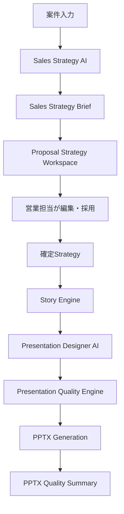

# Version81 Project Structure

Ready Crew Proposal AI / ProposalPilot

作成日: 2026-07-26

---

## 1. 主要ディレクトリ

| ディレクトリ | 役割 |
|---|---|
| `frontend/` | Next.js / Reactによる画面実装 |
| `frontend/components/proposal-experience/` | Proposal Studio、Version80〜81の提案作成体験UI |
| `frontend/app/styles/` | 画面スタイル、Proposal Experience用CSS |
| `frontend/e2e/` | Playwright E2Eテスト |
| `backend/` | FastAPI Backend |
| `backend/app/routers/` | API Router |
| `backend/app/services/` | PPTX、PDF、Beautiful.ai、Presentation DesignerなどのService層 |
| `backend/app/strategy_engine/` | Strategy Engine、Sales Strategy AI、Review、Evaluation系 |
| `backend/tests/` | Backend pytest |
| `docs/product-planning/v81/` | Version81 Planning Pack |
| `docs/training-submission/` | 研修提出用文書 |

---

## 2. 主要ファイル

| ファイル | 役割 |
|---|---|
| `frontend/components/proposal-experience/ProposalExperienceStudio.tsx` | Proposal Studio本体、Strategy Workspace、Designer、Quality表示 |
| `frontend/components/proposal-experience/presentationQuality.ts` | Presentation Quality EngineのFrontend側ロジック |
| `frontend/components/proposal-experience/presentationDesignerAi.ts` | Frontend側のLayout候補、Before / After、Score変化 |
| `frontend/components/proposal-experience/salesStrategyAi.ts` | Sales Strategy Review表示用の補助ロジック |
| `frontend/components/proposal-experience/strategyWorkspace.ts` | Proposal Strategy Workspace、差分、Score、Story候補 |
| `frontend/app/styles/proposal-experience.css` | Proposal Experience UIスタイル |
| `backend/app/strategy_engine/models.py` | Strategy Brief、Sales Strategy Brief、Workspace model |
| `backend/app/strategy_engine/sales_strategy.py` | Sales Strategy AIの決定論的生成ロジック |
| `backend/app/services/presentation_designer_ai.py` | Backend側Presentation Designer AI |
| `backend/app/services/pptx_quality.py` | PPTX Quality Pipeline、Quality Report |
| `backend/app/services/pptx_layout_integration.py` | Layout DecisionとPPTX Rendererの接続 |
| `backend/app/services/pptx_service.py` | 既存PPTX生成入口とVersion81 Quality / Layout連携 |
| `frontend/e2e/app.spec.ts` | Version81 E2E |
| `backend/tests/strategy_engine/test_sales_strategy_ai.py` | Sales Strategy AI pytest |
| `backend/tests/test_presentation_designer_ai.py` | Presentation Designer AI pytest |
| `backend/tests/test_pptx_quality_integration.py` | PPTX Quality Integration pytest |
| `backend/tests/test_pptx_layout_integration.py` | Layout Integration pytest |

---

## 3. 主要AI Engine

| Engine | 役割 | Version81での位置づけ |
|---|---|---|
| Sales Strategy AI | 案件概要から営業戦略を整理する | Story Engineより前段 |
| Proposal Strategy Workspace | AI案を営業担当が確認、編集、採用する | Human Reviewの中心 |
| Story Engine | 確定Strategyをもとに提案ストーリーを整理する | Strategy後段 |
| Presentation Designer AI | Slide Typeと内容からLayoutを提案する | PPTX生成前の資料設計 |
| Presentation Quality Engine | 18カテゴリで資料品質を評価する | 提出前品質確認 |
| Quality Rule Engine | タイトル長、本文量、箇条書き数、図解不足などを検出する | Quality Engine内 |
| Diagram Recommendation Engine | 比較表、Timeline、Roadmap、KPIカードなどを提案する | Quality Engine内 |
| Content Fit Engine | 圧縮、分割、図解化を提案する | Quality Engine内 |

---

## 4. 主要画面

| 画面 | 役割 |
|---|---|
| Proposal Studio | Version80〜81の提案作成体験の中心画面 |
| Prompt Builder | 案件概要や不足情報を整理する入力導線 |
| Sales Strategy Review | Sales Strategy AIの出力確認 |
| Proposal Strategy Workspace | AI案、営業担当編集、評価スコアの3ペイン画面 |
| Story Engine | 提案ストーリーとスライド構成の確認 |
| Presentation Designer | Layout候補、Before / After、Score変化の確認 |
| Presentation Quality Engine | 18カテゴリ評価、Findings、Auto Fixの確認 |
| PPTX Quality Summary | PPTX生成後のQuality Report確認 |

---

## 5. Version81の処理フロー

---

## 6. 実装しなかった領域

| 領域 | 理由 |
|---|---|
| ProposalVersion | Version82以降の履歴管理対象 |
| Generation Job | 非同期Queue化と合わせてVersion82以降 |
| Knowledge AI | 過去提案や顧客知識の活用は次段階 |
| DB永続保存 | Strategy Workspaceは今回メモリ上のUI体験まで |
| 共同編集 | WebSocket / realtime同期は未実装 |
| Autosave永続化 | DB設計と合わせて次Version候補 |
