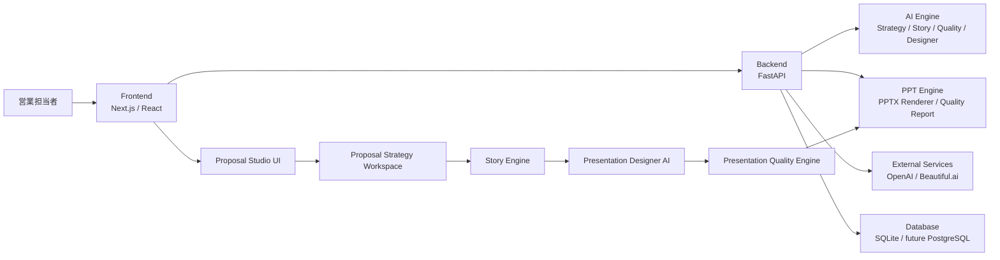
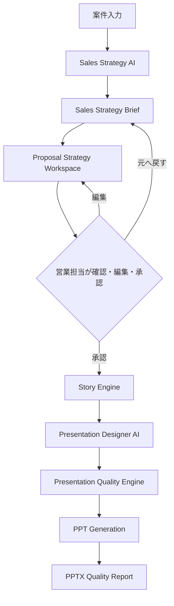
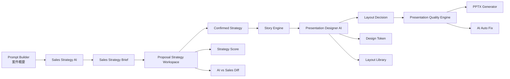

# Version81 Completion Report

Ready Crew Proposal AI / ProposalPilot
Version81 Planning Pack Completion Report

作成日: 2026-07-26

---

## 1. プロジェクト概要

### 目的

Ready Crew Proposal AIは、営業担当者が案件情報から提案戦略、提案ストーリー、PowerPoint構成、品質確認までを一貫して行えるようにするAI営業支援システムです。

Version81では、従来の「提案書を生成するAI」から一歩進めて、営業担当者とAIが協力しながら提案戦略と資料品質を高める仕組みを追加しました。

### 背景

これまでの提案書作成では、案件入力後にAIが提案書を生成し、営業担当者が結果を確認する流れが中心でした。しかし実務では、以下のような課題があります。

- AIが生成した提案の意図が見えにくい
- 提案戦略、ストーリー、資料レイアウト、品質評価が分断されやすい
- 営業担当者が修正した判断を後続工程に反映しにくい
- PowerPointとして見栄えは整っても、営業戦略として弱い場合がある
- 第三者が「何が改善されたのか」を把握しづらい

### 課題

Version81で特に解決した課題は次の通りです。

- 提案資料の品質を定量評価できない
- スライドごとの最適レイアウト判断が属人的
- PPTX出力時にDesigner AIの判断を反映しきれていない
- 案件に対して営業戦略を明確に設計する前段が弱い
- AI案を営業担当者が確認、編集、採用できるワークスペースがない

### 解決方法

Version81では、Planning Packを唯一の仕様書として扱い、以下の6フェーズで改善しました。

- Presentation Quality Engine
- PPT Quality Integration
- Presentation Designer AI
- Designer AI to PPTX Integration
- Sales Strategy AI
- Proposal Strategy Workspace

これにより、案件入力から営業戦略、Story、Designer、品質評価、PPTX生成までが一連の流れとしてつながりました。

---

## 2. システム構成



### Frontend

- Proposal Studio
- Prompt Builder
- Proposal Strategy Workspace
- Story Engine view
- Presentation Designer view
- Quality Score / Auto Fix view
- PPTX Quality Summary

### Backend

- Strategy Engine models
- Sales Strategy Brief
- Proposal Strategy Workspace model
- PPTX generation request handling
- PPTX quality integration
- Existing authentication and permission boundary

### AI Engine

- Sales Strategy AI
- Story Engine
- Presentation Designer AI
- Presentation Quality Engine
- Quality Rule Engine
- Diagram Recommendation Engine
- Content Fit Engine

### PPT Engine

- PPTX Renderer
- PPT Quality Integration
- Layout Decision Request
- PPTX Quality Report

---

## 3. Version81で追加した機能

### Phase1: Presentation Quality Engine

#### 目的

提案資料の品質を、感覚ではなくスコアと理由で評価できるようにすること。

#### 追加機能

- 18カテゴリ評価
- Presentation Score算出
- Quality Rule Engine
- Diagram Recommendation Engine
- Content Fit Engine
- AI Auto Fix
- 修正前 / 修正後の比較表示
- 適用 / 却下UI

#### ユーザー価値

営業担当者は、資料の弱点を「なんとなく」ではなく、スコア、理由、改善案として把握できます。資料作成後の確認時間を短縮し、提案品質のばらつきを減らせます。

### Phase2: PPT Quality Integration

#### 目的

画面上のQuality判断をPPTX生成時にも反映し、画面と出力物の品質確認をつなげること。

#### 追加機能

- PPTX生成リクエストへQuality Stateを連携
- PPTX生成後のQuality Report表示
- 適用済みAuto Fixの連携
- スライド数変化、数値保持、Layout状態の確認

#### ユーザー価値

画面で確認した改善内容が、PPTX出力時にも追跡できます。提出前に「何が適用され、何が未確認か」を確認しやすくなりました。

### Phase3: Presentation Designer AI

#### 目的

「スライドを作る」だけではなく、各スライドを最も伝わるレイアウトへ設計すること。

#### 追加機能

- Slide Type分類
- Layout Library
- Layout Decision Engine
- Design Token
- Variation制御
- Designer Preview
- Before / After比較
- Presentation Score連携

#### ユーザー価値

営業担当者は、スライドごとにどのレイアウトが適切か、なぜそのレイアウトが推奨されるかを確認できます。資料デザインの属人性を減らせます。

### Phase4: Designer AI to PPTX Integration

#### 目的

Presentation Designer AIの判断を、実際のPPTX生成リクエストへ安全に渡すこと。

#### 追加機能

- Layout Decision Request
- PPTX Rendererとの対応
- Unsupported Layoutの扱い
- Backend fallback report
- PreviewとPPTXの差分検出

#### ユーザー価値

Designer AIで選んだレイアウトがPPTX生成時にも利用されます。未対応レイアウトがある場合も、安全にfallbackされ、品質レポートで確認できます。

### Phase5: Sales Strategy AI

#### 目的

「PowerPointを作るAI」ではなく、「営業担当の代わりに提案戦略を考えるAI」を追加すること。

#### 追加機能

- Sales Strategy Brief
- Decision Maker分析
- Competitive Position分類
- Proposal Position判定
- Winning Strategy生成
- Expected Objections生成
- Presentation Tone分類
- Story Engine連携
- Presentation Designer連携

#### ユーザー価値

AIが、誰に、何を、どの順番で、どのトーンで提案すべきかを整理します。営業担当者は、資料作成前に提案戦略の骨子を確認できます。

### Phase6: Proposal Strategy Workspace

#### 目的

AIが営業戦略を一方的に提案するのではなく、営業担当者とAIが一緒に営業戦略を完成させること。

#### 追加機能

- Proposal Strategy Workspace
- AI提案と営業担当編集の3ペイン表示
- 編集可能なSales Strategy項目
- AI案と営業編集後の差分表示
- Strategy Score
- 不足情報 / 推測情報の確認済み化
- Story候補の比較と選択
- Presentation Tone比較
- 元へ戻す
- 承認済みStrategyのみStory Engineへ連携

#### ユーザー価値

AIの提案を営業担当者が確認、編集、採用できます。営業担当者の判断がStory EngineやPresentation Designerへ反映されるため、実案件に近い提案戦略を作れます。

---

## 4. AI全体フロー



---

## 5. システム構成図



---

## 6. 主な画面

| 画面 | 役割 | 主な遷移 |
|---|---|---|
| Prompt Builder | 案件情報を整理して入力する | Sales Strategy確認へ |
| Proposal Strategy Workspace | AI提案を確認、編集、採用する | Story Engineへ |
| Story Engine | 確定Strategyをもとに提案ストーリーを確認する | 3ペイン編集 / Presentation Designerへ |
| 3ペイン編集 | スライド構成、本文、AI修正を確認する | Designerへ |
| Designer | Presentation Quality EngineとAuto Fixを確認する | PPTX生成へ |
| Presentation Designer | Layout候補、Before/After、Score変化を確認する | Designer / PPTX生成へ |
| PPTX Quality Summary | PPTX生成後の品質結果を確認する | 再編集へ |

---

## 7. 技術構成

### Frontend

- Next.js
- React
- TypeScript
- Playwright E2E
- CSS modules / application CSS
- Lucide React icons

### Backend

- FastAPI
- Pydantic
- pytest
- SQLite
- Existing auth / role / workspace scope

### AI Engine

- Deterministic local rule engine
- Sales Strategy AI
- Story Engine
- Presentation Designer AI
- Presentation Quality Engine

### PPT Engine

- PPTX Renderer
- Layout Decision integration
- Quality Report integration

### 主要ライブラリ

- `next`
- `react`
- `typescript`
- `@playwright/test`
- `fastapi`
- `pydantic`
- `pytest`
- `python-pptx` related internal service layer

---

## 8. テスト結果

| 対象 | 内容 | 結果 |
|---|---|---|
| Phase1 | Presentation Quality Engine / Auto Fix E2E | 成功 |
| Phase2 | PPTX Quality Summary / Quality State連携 | 成功 |
| Phase3 | Presentation Designer AI / Layout候補 / Before After | 成功 |
| Phase4 | Layout DecisionをPPTX requestへ渡すE2E | 成功 |
| Phase5 | Sales Strategy ReviewからStory / Designerへ連携 | 成功 |
| Phase6 | Proposal Strategy Workspaceの編集、差分、Story/Tone選択 | 成功 |
| Backend | Sales Strategy / Workspace model / Designer関連pytest | 成功 |
| Frontend | typecheck | 成功 |
| Frontend | check:unused | 成功 |
| Frontend | build | 成功 |
| E2E | Version81関連E2E 5件 | 成功 |
| Backend | compileall | 成功 |
| Backend | pip check | 成功 |
| Common | git diff --check | 成功 |

最終確認時点の代表結果:

- Version81 E2E: 5 passed
- Backend Strategy Engine関連: 成功
- Frontend build: 成功

---

## 9. 人間確認項目

- AIが提案したWinning Strategyが案件内容に合っているか
- Decision Maker分類が実際の商談相手と合っているか
- Competitive Positionが現実の競合状況と合っているか
- Expected Objectionsが商談で想定される反論に近いか
- Proposal Positionが営業方針として自然か
- Presentation Toneが顧客に合っているか
- Strategy Scoreの評価理由が納得できるか
- Story候補3案から選びやすいか
- Tone比較が完成イメージの判断に役立つか
- 承認したStrategyがStory Engineへ反映されているか
- Presentation Designerの判断理由に確定Strategyが反映されているか
- PPTX生成後のQuality Reportが提出前確認に使えるか

---

## 10. Version82ロードマップ

| 優先度 | 項目 | 内容 |
|---|---|---|
| 1 | ProposalVersion | Strategy、Story、Designer、Quality結果をバージョン管理する |
| 2 | 永続保存 | Workspaceの編集内容、承認状態、差分をDBに保存する |
| 3 | Generation Job | 生成処理をJobとして管理し、失敗や再実行を扱いやすくする |
| 4 | Queue | PPTX生成やAI処理を非同期Queue化する |
| 5 | Knowledge AI | 過去提案、顧客情報、業界知識をStrategyに反映する |
| 6 | 承認履歴 | 誰が、いつ、何を承認したかを記録する |
| 7 | 共同編集 | 複数営業担当によるレビューを可能にする |
| 8 | Review Comment | 戦略項目ごとにコメントを残せるようにする |
| 9 | AI再提案 | 営業編集をもとにAIが再提案する |
| 10 | Observability | Strategy Score、採用率、修正率を監視する |

---

## 11. 今回実装しなかったもの

Version81では、以下は意図的に実装していません。

- ProposalVersion
- Generation Job
- Knowledge AI
- Autosave永続化
- 共同編集
- DB Migration
- Queue
- WebSocket
- Realtime collaboration
- Strategy WorkspaceのDB保存
- 承認履歴の永続化
- 新しい外部AI呼び出し
- 新しいPPTX生成エンジン
- Beautiful.ai仕様変更
- Deploy
- Git commit / push

---

## 12. 完成度自己評価

### 現在完成している範囲

- 案件入力からSales Strategy AIへの連携
- Sales Strategy Brief生成
- AI案と営業担当編集の比較
- Strategy Score評価
- Story候補選択
- Presentation Tone比較
- 承認済みStrategyからStory生成
- Presentation DesignerへのStrategy連携
- PPTX生成時のQuality / Layout連携
- Version81関連E2E

### 未実装範囲

- Strategy Workspaceの永続保存
- ProposalVersionによる履歴管理
- 複数ユーザー共同レビュー
- Knowledge AIによる過去提案参照
- Job / Queueによる生成管理
- 承認ワークフローの監査ログ

### 課題

- 現状は画面内メモリ中心のため、リロードするとWorkspace編集内容は失われる
- Strategy Scoreは決定論的ルールであり、実案件レビューによる重み調整が必要
- Story候補は最大3案だが、案件種別ごとの最適化余地がある
- Presentation Toneの比較はテキスト説明中心で、将来はビジュアルプレビューが必要

### 今後の改善

- Pilotで実案件を使い、Strategy Scoreと人間評価の相関を見る
- よく編集される項目を分析し、Sales Strategy AIの初期案を改善する
- 承認済みStrategyをProposalVersionとして保存する
- Knowledge AIで過去提案や顧客特性を参照する

---

## 13. README更新案

以下をREADMEへ追記する案です。

```markdown
## Version81: Proposal Strategy and Presentation Quality

Version81では、提案書生成の前段にSales Strategy AIとProposal Strategy Workspaceを追加しました。

主な機能:

- Presentation Quality Engineによる18カテゴリ評価
- Quality Rule Engine / Diagram Recommendation / Content Fit
- AI Auto Fixによる修正前後比較
- Presentation Designer AIによるスライド別Layout提案
- Layout DecisionのPPTX生成連携
- Sales Strategy AIによる営業戦略の自動生成
- Proposal Strategy WorkspaceによるAI案と営業担当編集の比較
- Strategy Score、Story候補、Presentation Tone比較

利用フロー:

1. Prompt Builderで案件概要を入力
2. Sales Strategy AIが営業戦略を提案
3. Proposal Strategy Workspaceで営業担当が確認・編集・承認
4. Story Engineで提案ストーリーを確認
5. Presentation Designer AIでスライドレイアウトを確認
6. Presentation Quality Engineで資料品質を確認
7. PowerPointを生成
```

---

## 14. 発表用要約

### 3分発表原稿

今回のVersion81では、Ready Crew Proposal AIを「提案書を作るAI」から「営業担当と一緒に提案戦略を完成させるAI」へ進化させました。

まず、Presentation Quality Engineを追加し、提案資料を18カテゴリで評価できるようにしました。これにより、資料の弱点や改善点をスコアと理由で確認できます。

次に、Presentation Designer AIを追加しました。各スライドの内容や目的を見て、最適なレイアウトを提案します。Before / Afterで変更効果を確認でき、PPTX生成にもLayout Decisionを渡せるようにしました。

さらに、Sales Strategy AIを追加しました。案件概要から、意思決定者、競合状況、提案ポジション、想定反論、勝ち筋を整理します。

最後に、Proposal Strategy Workspaceを追加しました。AIの提案を営業担当者が確認、編集、採用でき、差分やStrategy Scoreも確認できます。承認したStrategyだけがStory EngineとPresentation Designerへ渡されます。

これにより、AIが一方的に資料を作るのではなく、営業担当者とAIが協力して、より実務に近い提案戦略と資料を作れるようになりました。

### 5分発表原稿

Version81の目的は、Ready Crew Proposal AIを単なる資料生成ツールではなく、営業戦略から資料品質まで支援するAI営業秘書へ進化させることです。

最初に取り組んだのは、Presentation Quality Engineです。これまでは生成された資料の良し悪しを人間が感覚で判断していました。Version81では、タイトル、本文量、図解、強調、レイアウト重複、1ページ1メッセージなどを評価し、18カテゴリでスコア化しました。また、Auto Fixにより修正前と修正後を比較し、営業担当者が適用または却下できるようにしました。

次に、Presentation Designer AIを追加しました。これは、スライドごとにCover、Problem、Comparison、Timeline、KPIなどのSlide Typeを判定し、最適なLayoutを提案する機能です。Layout LibraryとDesign Tokenを持ち、同じLayoutが続きすぎないようにVariationも考慮します。これにより、見た目だけでなく、伝わりやすさを意識した資料設計ができます。

その後、Designer AIの判断をPPTX生成へつなぎました。画面上で提案されたLayout DecisionをPPTX生成リクエストへ渡し、生成後にはQuality Reportで確認できます。

さらに、Sales Strategy AIを追加しました。案件概要から、顧客業界、意思決定者、競合状況、提案ポジション、勝ち筋、想定反論、推奨Story、Presentation Toneを整理します。これにより、資料作成の前に営業戦略を明確化できます。

最後に、Proposal Strategy Workspaceを追加しました。AI案をそのまま使うのではなく、営業担当者が編集し、差分を確認し、Strategy Scoreを見ながら承認できます。承認されたStrategyだけがStory EngineやPresentation Designerへ渡されるため、AIと人間の判断を両立できます。

Version81によって、案件入力、営業戦略、Story、Designer、Quality、PPTX生成が一つの流れになりました。

### 10分発表原稿

今回のVersion81では、Ready Crew Proposal AIの中核体験を大きく改善しました。テーマは「AIが資料を作る」から「AIと営業担当者が一緒に提案戦略を完成させる」への進化です。

従来のAI提案書生成では、案件情報を入力するとAIが提案書を出力し、人間が後から修正する流れが中心でした。しかし実際の営業現場では、提案書の見た目だけでなく、誰に向けて、何を、どの順番で伝えるかが非常に重要です。Version81では、この課題に対して6つのPhaseで対応しました。

Phase1ではPresentation Quality Engineを実装しました。資料の品質を18カテゴリで評価し、改善理由と改善提案を表示します。例えば、タイトルが長すぎる、本文量が多すぎる、図解が不足している、比較表が必要、1ページ1メッセージになっていない、といった点を検出します。さらにAI Auto Fixにより、修正前と修正後を比較して、人間が適用または却下できます。

Phase2では、この品質評価をPPTX生成へつなげました。画面上で適用した修正や品質状態がPPTX生成時にも渡され、生成後にQuality Reportとして確認できます。これにより、画面上の確認と出力物の確認が分断されなくなりました。

Phase3ではPresentation Designer AIを追加しました。これは、各スライドをCover、Problem、Comparison、Timeline、KPI、Estimateなどに分類し、最も伝わりやすいLayoutを提案する機能です。単にテンプレートを選ぶのではなく、文章量、比較の有無、数値、意思決定者、Story Type、Quality Findingsを見て判断します。

Phase4では、Designer AIのLayout DecisionをPPTX生成へ連携しました。これにより、Designer AIが提案したLayout情報をPPTX生成リクエストに含められるようになりました。未対応Layoutがある場合もfallbackされ、品質レポートで確認できます。

Phase5ではSales Strategy AIを追加しました。これはStory Engineより前に動くAIです。案件概要から、Project Category、Customer Industry、Decision Maker、Competitive Situation、Proposal Position、Winning Strategy、Expected Objections、Presentation Toneなどを整理します。つまり、資料を作る前に営業戦略を作るAIです。

Phase6ではProposal Strategy Workspaceを追加しました。AIが作った戦略を営業担当者が確認、編集、採用できます。画面は3ペイン構成で、左にAI案、中央に営業担当の編集、右にStrategy Scoreを表示します。変更した内容は差分として見え、不足情報や推測情報は確認済みにできます。また、Story候補を最大3案から選び、Presentation Toneも比較できます。

重要なのは、承認済みStrategyだけがStory EngineとPresentation Designerへ渡される点です。AI初期案をそのまま後続工程へ流すのではなく、人間が確認した営業戦略をもとに資料設計へ進みます。

今回のVersion81により、Ready Crew Proposal AIは、案件入力、営業戦略、Story、Presentation Designer、Quality Engine、PPTX生成までが一つの流れになりました。これは、社内研修課題としても、単なる時短だけでなく、営業品質の標準化と提案力向上を示せる成果です。

---

## 15. 最終成果一覧

### 主要ファイル

| 分類 | ファイル |
|---|---|
| Frontend UI | `frontend/components/proposal-experience/ProposalExperienceStudio.tsx` |
| Frontend Types | `frontend/components/proposal-experience/types.ts` |
| Strategy Workspace | `frontend/components/proposal-experience/strategyWorkspace.ts` |
| Sales Strategy AI | `frontend/components/proposal-experience/salesStrategyAi.ts` |
| Presentation Designer AI | `frontend/components/proposal-experience/presentationDesignerAi.ts` |
| Quality Engine | `frontend/components/proposal-experience/presentationQualityEngine.ts` |
| Styles | `frontend/app/styles/proposal-experience.css` |
| Backend Models | `backend/app/strategy_engine/models.py` |
| Backend Sales Strategy | `backend/app/strategy_engine/sales_strategy.py` |
| Backend Designer | `backend/app/services/presentation_designer_ai.py` |
| Backend PPT Quality | `backend/app/services/pptx_quality.py` |
| Backend Layout Integration | `backend/app/services/pptx_layout_integration.py` |
| E2E | `frontend/e2e/app.spec.ts` |
| Backend Tests | `backend/tests/strategy_engine/test_sales_strategy_ai.py` |

### 主要画面

- Prompt Builder
- Proposal Strategy Workspace
- Story Engine
- 3ペイン編集
- Designer
- Presentation Designer
- PPTX Quality Summary

### 主要AI

- Sales Strategy AI
- Story Engine
- Presentation Designer AI
- Presentation Quality Engine
- Quality Rule Engine
- Diagram Recommendation Engine
- Content Fit Engine
- AI Auto Fix

### 主要テスト

- Presentation Quality Engine E2E
- Sales Strategy Review E2E
- Proposal Strategy Workspace E2E
- Presentation Designer AI E2E
- Layout Decision to PPTX request E2E
- Sales Strategy AI pytest
- Strategy Workspace model pytest
- Presentation Designer pytest

---

## 結論

Version81では、Ready Crew Proposal AIが「提案書生成ツール」から「営業戦略と資料品質を一緒に作るAI営業秘書」へ進化しました。

特に、Proposal Strategy Workspaceにより、AIの初期提案と営業担当者の判断を比較し、承認済みの戦略だけをStory EngineとPresentation Designerへ渡せるようになった点が大きな成果です。

Version82では、今回のWorkspaceを永続化し、ProposalVersion、Knowledge AI、Generation Jobへ接続することで、実運用に近い提案作成基盤へ拡張できます.
